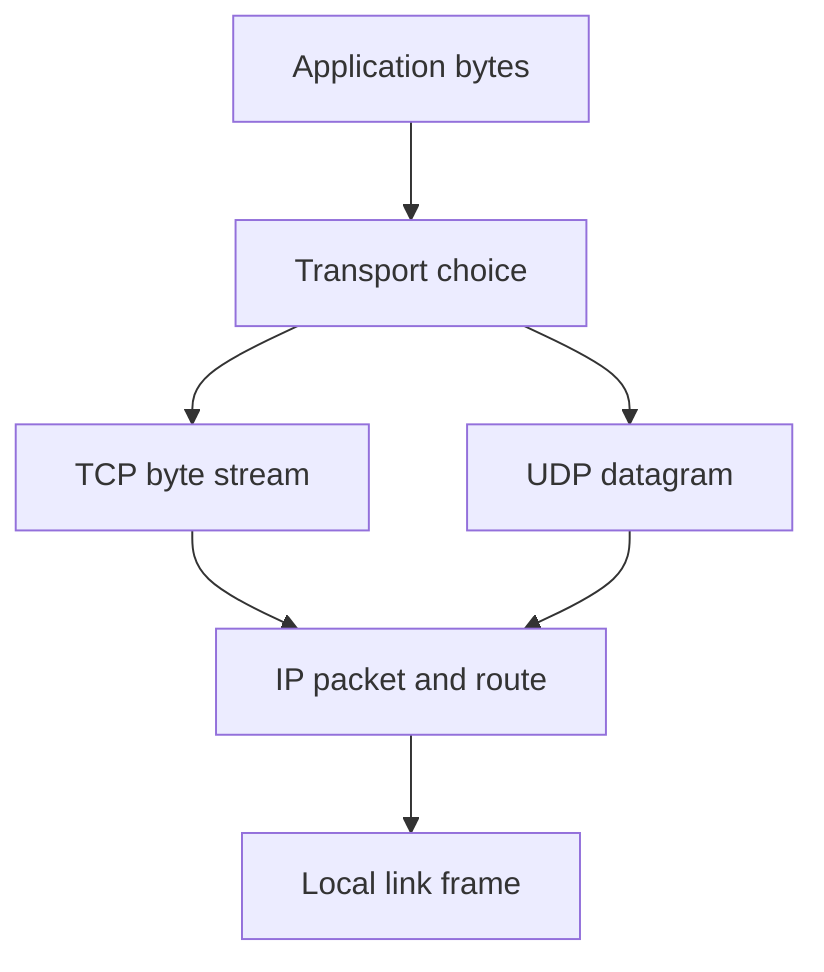

# Chapter 00 — Networking and C prerequisites

🟢 · [Course home](../README.md) · [Setup](../START_HERE.md)

## 🎯 Learning Objectives

Distinguish hosts, interfaces, IP addresses, ports and protocols; read C byte buffers; convert between host and network byte order.

## 🤔 Why Do We Need This?

Before a socket call makes sense, you need to know what endpoint it describes and how its C arguments represent that endpoint. A correct algorithm with the wrong byte order can connect to the wrong port.

## Further reading and labs

- [Networking basics](networking-basics.md)
- [IP addressing](ip-addresses.md)
- [Ports](ports.md)
- [OSI model](osi-model.md)
- [TCP/IP model](tcp-ip-model.md)
- [Client/server model](client-server-model.md)
- [C readiness checklist](c-readiness.md)

## 🧠 Concept

A network moves data between endpoints. An IP address identifies an interface or routing destination within an address family; a transport port helps demultiplex data to an application endpoint. TCP and UDP have separate port spaces, so a TCP listener and UDP receiver can both use port 9000.

The operating system adds protocol headers around your application bytes and removes them on receipt. A switch forwards local link frames; a router moves IP packets between networks. `127.0.0.1` is IPv4 loopback, while `::1` is IPv6 loopback. Neither means another laptop on your Wi-Fi.

C strings end at a NUL byte; network payloads need not. A buffer capacity is the amount of available storage, while a byte count is the amount currently valid. Keep these separate. `ssize_t` can hold -1 for an error; converting it to an unsigned size before checking can create a huge positive length.

Network byte order is big endian. Port 9000 is hexadecimal `0x2328`, so its wire representation has byte `0x23` before `0x28`. `htons` and `ntohs` handle host differences without assuming your machine's endianness.

## 🏗️ Architecture



## 🔄 How It Works

Read a host-order integer; convert it with htons; copy its representation to unsigned bytes; print bytes; convert back with ntohs.

## 🔧 Important Functions

`htons`, `ntohs`, `memcpy`, `printf`; fixed-width `uint16_t` and byte-oriented `unsigned char`.

See the [API reference](../docs/socket-api.md) for signatures, parameters, returns,
examples and common mistakes. Shared helpers are explained in
[common/README.md](../common/README.md).

## 💻 Minimal Example

Read the complete, compilable [source](byte-order.c). This is an opening excerpt
for orientation; compile the complete file using the command below:

```c
/* Step: Copy the representation to bytes without violating alignment or aliasing. */
int main(void) {
    uint16_t host = 9000;
    uint16_t network = htons(host);
    unsigned char bytes[sizeof network];
    memcpy(bytes, &network, sizeof bytes);
    printf("port=%u wire=%02x %02x roundtrip=%u\n",
           (unsigned)host, (unsigned)bytes[0], (unsigned)bytes[1],
           (unsigned)ntohs(network));
    return 0;
}
```

## 🔍 Line-by-Line Explanation

Follow the [numbered source and walkthrough](../docs/walkthroughs/byte_order.md) alongside the program.
Each source block explains its purpose, underlying OS behavior, failure path and
an extension. Important socket operations also have individual entries in the
[API reference](../docs/socket-api.md). Trace variable lengths as carefully as
function names.

## ▶️ Compilation

From the repository root:

```bash
make build/byte_order
```

The [build/run catalogue](../docs/program-catalogue.md) gives a direct `cc` command
for every executable. You can use `make -j2` once to build all examples.

## ▶️ Execution

Run the marked terminal commands in separate terminals where applicable.

```bash
./build/byte_order
```

## 📤 Expected Output

```text
port=9000 wire=23 28 roundtrip=9000
```

Values in angle brackets describe variable output; they are not recorded results.

## 🧪 Experiment

Change 9000 to 80 and then 443. Predict `00 50` and `01 bb` before running. The output is independent of host endianness.

## 🛠️ Modify the Code

Add a uint32_t example with htonl/ntohl using 0x01020304. Print the bytes through memcpy rather than type-punning a misaligned pointer.

## 🐛 Common Errors

Confusing an IP address with a MAC address; using sizeof(pointer) as a buffer length; treating binary bytes as a printf %s string.

## 💡 Debugging Tips

Print lengths and byte values separately. Compile with warnings enabled; explain every warning before proceeding.

## 🎯 Practice Problems

- 🟢 **Beginner:** Identify the TCP and UDP endpoints for two programs using 127.0.0.1:9000.
- 🟡 **Intermediate:** Encode port 8080 as two network-order bytes without looking at the program.
- 🔴 **Advanced:** Design a five-byte record: one type byte followed by a uint32 length. Why not send a C struct?

Attempt these before opening [worked solutions](solutions.md).

## 📝 Exam Questions

**Question:** Explain encapsulation using a one-line chat message.

**Worked answer:** Application bytes become transport payload; the transport unit becomes IP payload; the IP packet travels within link-layer framing. At the destination, each layer interprets its own header.

## 🎤 Viva Questions

**Question:** Does 127.0.0.1 refer to my router?

**Worked answer:** No. It is the local host loopback address.

## 💼 Interview Questions

**Question:** Why keep received length separate from buffer capacity?

**Worked answer:** Only the returned prefix is valid. Reading or printing the rest exposes stale/uninitialized bytes; assuming a terminator can overrun the buffer.

## 🚀 Mini Project

Create a byte-order inspector for a port and a four-byte length. Reject values outside their defined ranges and explain each output byte.

Record your prediction, commands, output and explanation using the
[lab notebook](../docs/lab-notebook.md). The [solutions](solutions.md) include an
acceptance checklist for this extension.

## ✅ Chapter Summary

Addresses locate endpoints; protocols and ports demultiplex traffic; wire formats encode bytes explicitly.

## ➡️ Next Chapter

Continue to [Chapter 01 — Socket fundamentals](../01-socket-fundamentals/README.md).
