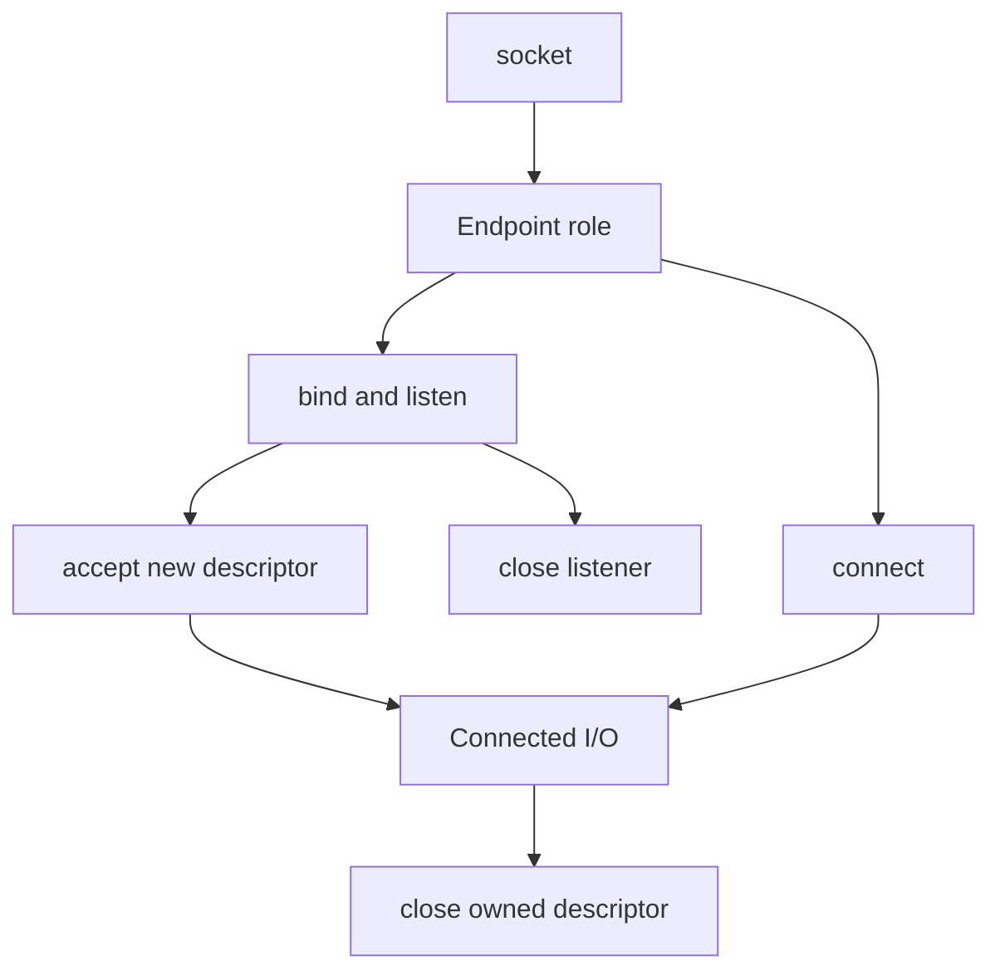

# Chapter 01 — Socket fundamentals

🟢 · [Course home](../README.md) · [Setup](../START_HERE.md)

## 🎯 Learning Objectives

Explain what a socket descriptor represents; choose a family and socket type; query an option and release ownership.

## 🤔 Why Do We Need This?

Socket programming is an interface to kernel state. Confusing a descriptor with the network connection leads to incorrect assumptions about sharing, closing and readiness.

## Further reading and labs

- [Socket versus descriptor](what-is-a-socket.md)
- [Socket lifecycle](socket-lifecycle.md)
- [Address structures](socket-addresses.md)

## 🧠 Concept

A socket is a kernel-managed communication endpoint accessed through a process file descriptor. `socket(AF_INET, SOCK_STREAM, 0)` requests an IPv4 stream socket; the normal protocol for that combination is TCP. This allocation alone neither binds a listening service nor connects to a peer.

A descriptor is a small nonnegative integer meaningful in the current process descriptor table. The number can be reused after close. It is not a port, IP address or stable client identity. Two descriptors can refer to the same underlying open file description after `dup` or `fork`.

`sockaddr` is the generic API address type, `sockaddr_in` holds IPv4 details, and `sockaddr_in6` holds IPv6 details. `sockaddr_storage` has room/alignment for supported address structures. `socklen_t` describes address storage length; calls such as accept and recvfrom update it.

The first experiment queries SO_TYPE. Notice that getsockopt receives pointers to both an output value and its length. You supply capacity before the call; the kernel reports the actual result size afterward.

## 🏗️ Architecture



## 🔄 How It Works

Allocate a socket; validate that the descriptor is nonnegative; initialize option storage and length; query SO_TYPE; print; close exactly once.

## 🔧 Important Functions

`socket`, `getsockopt`, `close`; `AF_INET`, `SOCK_STREAM`, `SOL_SOCKET`, `SO_TYPE`, `socklen_t`.

See the [API reference](../docs/socket-api.md) for signatures, parameters, returns,
examples and common mistakes. Shared helpers are explained in
[common/README.md](../common/README.md).

## 💻 Minimal Example

Read the complete, compilable [source](examples/socket-info.c). This is an opening excerpt
for orientation; compile the complete file using the command below:

```c
/* Step: socket allocates a descriptor; it does not create a TCP connection. */
int main(void) {
    int fd = socket(AF_INET, SOCK_STREAM, 0);
    if (fd < 0) { perror("socket"); return EXIT_FAILURE; }
    /* Step: getsockopt writes both the option value and its actual byte length. */
    int type = 0;
    socklen_t length = sizeof type;
    if (getsockopt(fd, SOL_SOCKET, SO_TYPE, &type, &length) < 0) {
        perror("getsockopt"); if (close(fd) < 0) perror("close"); return EXIT_FAILURE;
    }
    printf("descriptor=%d type=%d (SOCK_STREAM=%d)\n", fd, type, SOCK_STREAM);
    /* Step: Each successful socket needs an owner responsible for closing it. */
    if (close(fd) < 0) { perror("close"); return EXIT_FAILURE; }
    return 0;
```

## 🔍 Line-by-Line Explanation

Follow the [numbered source and walkthrough](../docs/walkthroughs/socket_info.md) alongside the program.
Each source block explains its purpose, underlying OS behavior, failure path and
an extension. Important socket operations also have individual entries in the
[API reference](../docs/socket-api.md). Trace variable lengths as carefully as
function names.

## ▶️ Compilation

From the repository root:

```bash
make build/socket_info
```

The [build/run catalogue](../docs/program-catalogue.md) gives a direct `cc` command
for every executable. You can use `make -j2` once to build all examples.

## ▶️ Execution

Run the marked terminal commands in separate terminals where applicable.

```bash
./build/socket_info
```

## 📤 Expected Output

```text
descriptor=<host-dependent integer> type=<SOCK_STREAM value> (SOCK_STREAM=<same value>)
```

Values in angle brackets describe variable output; they are not recorded results.

## 🧪 Experiment

Replace SOCK_STREAM with SOCK_DGRAM and compare the reported type. Allocation still succeeds without any server running.

## 🛠️ Modify the Code

Query SO_RCVBUF as an additional option. Reset the length before the second getsockopt call and label its returned value as host-dependent.

## 🐛 Common Errors

Assuming descriptor 3 is guaranteed; checking fd == 0 instead of fd < 0; forgetting to initialize the getsockopt length.

## 💡 Debugging Tips

Use `strace -e socket,getsockopt,close ./build/socket_info` if strace is installed. Match each syscall with a source statement.

## 🎯 Practice Problems

- 🟢 **Beginner:** Explain why a successful socket call does not prove a server is reachable.
- 🟡 **Intermediate:** Add a failing getsockopt experiment using an invalid descriptor. What should be checked?
- 🔴 **Advanced:** Explain why storing only a descriptor number in a long-lived asynchronous job is risky.

Attempt these before opening [worked solutions](solutions.md).

## 📝 Exam Questions

**Question:** Compare socket, address and descriptor.

**Worked answer:** The socket is kernel endpoint state; an address names an endpoint; the descriptor is a process-local reference used to operate on that state.

## 🎤 Viva Questions

**Question:** Can descriptor zero be a valid socket?

**Worked answer:** Yes, if that descriptor number was available. Only a negative socket return indicates failure.

## 💼 Interview Questions

**Question:** Why is close ownership important in a threaded server?

**Worked answer:** Threads share a descriptor table. Closing another worker's descriptor can abort its operation and allow the number to be reused unexpectedly.

## 🚀 Mini Project

Write a socket-capability inspector that creates IPv4 TCP, IPv4 UDP and IPv6 TCP sockets, prints success/failure for each and closes every successful allocation.

Record your prediction, commands, output and explanation using the
[lab notebook](../docs/lab-notebook.md). The [solutions](solutions.md) include an
acceptance checklist for this extension.

## ✅ Chapter Summary

A socket descriptor references kernel state. Choose types intentionally and assign exactly one owner to each live descriptor.

## ➡️ Next Chapter

Continue to [Chapter 02 — Your first TCP server](../02-tcp-server/README.md).
