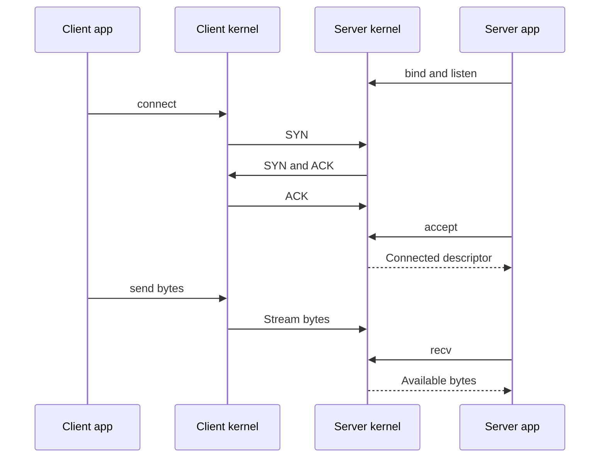

# Chapter 02 — Your first TCP server

🟢 · [Course home](../README.md) · [Setup](../START_HERE.md)

## 🎯 Learning Objectives

Build and explain socket → bind → listen → accept; distinguish listening and connected descriptors; echo bytes until orderly EOF.

## 🤔 Why Do We Need This?

A server must publish a local endpoint and accept established TCP connections before it can exchange data. This chapter makes every system call visible without shared helpers.

## 🧠 Concept

TCP provides an ordered reliable byte stream while a connection operates. It detects loss, retransmits data and applies flow/congestion control. It does not turn your application writes into records, and it cannot guarantee that the peer application processed a successfully sent request.

`bind` chooses the server's local address and port. `listen` enables passive acceptance and configures the pending-connection queue subject to OS policy. The backlog argument is not a maximum number of application clients. `accept` returns a new descriptor for one connected peer while leaving the listening descriptor available for later connections.

The three-way handshake establishes TCP state: the active opener sends SYN, the listener replies SYN+ACK, and the active opener acknowledges. The kernel performs this exchange; application accept retrieves an available connection, and need not be executing at the exact instant each handshake packet arrives.

This minimal server accepts one client, loops over received bytes and echoes every byte. `recv` can return fewer bytes than the buffer capacity. A positive-length stream receive returning zero means orderly peer shutdown of that direction. We ignore SIGPIPE so a failed send can be handled as an error.

## 🏗️ Architecture



## 🔄 How It Works

Validate the port; create an IPv4 stream socket; set SO_REUSEADDR; bind loopback; listen; accept a connected socket; receive and fully echo each chunk; close both descriptors.

## 🔧 Important Functions

`socket`, `setsockopt`, `bind`, `listen`, `accept`, `recv`, `send`, `close`; `htons`, `htonl`, `errno`, `EINTR`.

See the [API reference](../docs/socket-api.md) for signatures, parameters, returns,
examples and common mistakes. Shared helpers are explained in
[common/README.md](../common/README.md).

## 💻 Minimal Example

Read the complete, compilable [source](server.c). This is an opening excerpt
for orientation; compile the complete file using the command below:

```c
/* Step: This first server is standalone and deliberately serves one connection. */
int main(int argc, char **argv) {
    if (argc != 2) { fprintf(stderr, "usage: %s PORT\n", argv[0]); return 1; }
    char *end;
    errno = 0;
    long port = strtol(argv[1], &end, 10);
    if (errno || end == argv[1] || *end || port < 1 || port > 65535) {
        fprintf(stderr, "PORT must be 1..65535\n"); return 1;
    }
    if (signal(SIGPIPE, SIG_IGN) == SIG_ERR) { perror("signal"); return 1; }
    int listener = -1, peer = -1, status = 1;
    listener = socket(AF_INET, SOCK_STREAM, 0);
    if (listener < 0) { perror("socket"); goto done; }
    /* Step: Bind only loopback. htons converts the integer port to network order. */
```

## 🔍 Line-by-Line Explanation

Follow the [numbered source and walkthrough](../docs/walkthroughs/tcp_server.md) alongside the program.
Each source block explains its purpose, underlying OS behavior, failure path and
an extension. Important socket operations also have individual entries in the
[API reference](../docs/socket-api.md). Trace variable lengths as carefully as
function names.

## ▶️ Compilation

From the repository root:

```bash
make build/tcp_server build/tcp_client
```

The [build/run catalogue](../docs/program-catalogue.md) gives a direct `cc` command
for every executable. You can use `make -j2` once to build all examples.

## ▶️ Execution

Run the marked terminal commands in separate terminals where applicable.

```bash
# Terminal A
./build/tcp_server 9000
# Terminal B (build the client with make first)
./build/tcp_client 127.0.0.1 9000 "hello"
```

## 📤 Expected Output

```text
Server: Listening on 127.0.0.1:9000; one connection
Client: hello
Server exits after the client finishes.
```

Values in angle brackets describe variable output; they are not recorded results.

## 🧪 Experiment

Start two copies on port 9000. The second bind should fail while the first listener is active. Change both server and client to 9001 to resolve it.

## 🛠️ Modify the Code

Print the remote address by supplying initialized sockaddr_storage and socklen_t arguments to accept, then format with getnameinfo using numeric flags.

## 🐛 Common Errors

Calling recv on the listener; echoing sizeof(buffer) instead of the received count; sending only once and dropping an unsent suffix; assuming SO_REUSEADDR shares an active port.

## 💡 Debugging Tips

Run `ss -ltnp` while the server waits. Use two different variable names for listener and peer and trace which one appears in recv/send.

## 🎯 Practice Problems

- 🟢 **Beginner:** Label each descriptor after accept succeeds.
- 🟡 **Intermediate:** Add a cumulative received-byte count and send an input containing repeated small writes.
- 🔴 **Advanced:** Explain why a server that calls send once per recv can corrupt a large echo exchange.

Attempt these before opening [worked solutions](solutions.md).

## 📝 Exam Questions

**Question:** Does backlog 8 limit the server to eight lifetime clients?

**Worked answer:** No. It concerns a kernel pending-connection queue, subject to OS behavior; application acceptance and resource policy determine how many clients are served over time.

## 🎤 Viva Questions

**Question:** Which descriptor do you pass to send after accept?

**Worked answer:** The connected descriptor returned by accept.

## 💼 Interview Questions

**Question:** Is SO_REUSEADDR a fix for two active listeners with identical local endpoints?

**Worked answer:** No. It supports particular bind-reuse cases such as restart behavior. It is not a general permission to take over another running service.

## 🚀 Mini Project

Extend the server to uppercase only ASCII a..z while leaving every other byte unchanged. Retain partial-write handling and binary-safe lengths.

Record your prediction, commands, output and explanation using the
[lab notebook](../docs/lab-notebook.md). The [solutions](solutions.md) include an
acceptance checklist for this extension.

## ✅ Chapter Summary

A listener accepts connections; connected descriptors carry data. Byte counts and cleanup paths are part of the protocol implementation.

## ➡️ Next Chapter

Continue to [Chapter 03 — Your first TCP client](../03-tcp-client/README.md).
