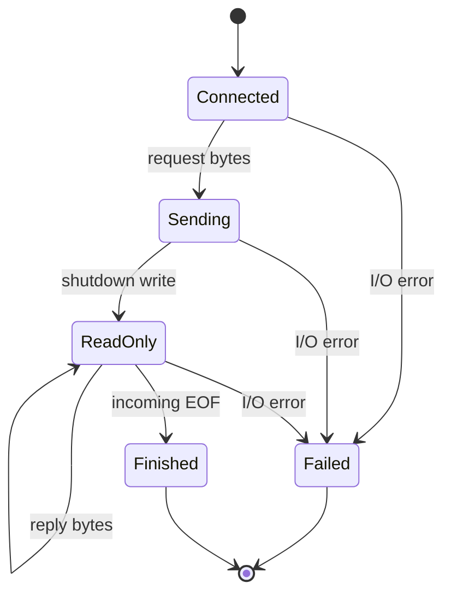

# Chapter 03 — Your first TCP client

🟢 · [Course home](../README.md) · [Setup](../START_HERE.md)

## 🎯 Learning Objectives

Create an active TCP connection, validate a numeric address, send a full message and explain half-close.

## 🤔 Why Do We Need This?

A request/response client needs to tell the server when its request is complete without closing the receive direction before a response arrives.

## 🧠 Concept

A client normally creates a stream socket and calls connect with the server endpoint. Unless explicitly bound first, the OS chooses a local source address/port appropriate to the route. The local client port need not equal the server's listening port.

This first client accepts a numeric IPv4 address, so `localhost` is not a valid argument here. `inet_pton` returns 1 for valid conversion, 0 for invalid presentation and -1 for an unsupported family/error. Name resolution is introduced through getaddrinfo in later shared helpers.

The client sends a bounded message, calls `shutdown(fd, SHUT_WR)` and continues receiving. SHUT_WR signals no more outgoing application bytes after previously queued data. It leaves the read side usable. The server observes EOF after consuming prior bytes, finishes echoing and closes; the client then sees EOF too.

This is an EOF-delimited request protocol. It handles one request per connection. Chapter 04 adds lengths so multiple messages can share a live connection. The 4096-byte CLI limit also keeps this teaching client's send-then-receive pattern small; a general bulk protocol needs framing, coordinated streaming or concurrent reads/writes.

## 🏗️ Architecture



## 🔄 How It Works

Validate port and message length; convert IPv4 text; allocate and connect a socket; send all bytes; shutdown the write side; read and print all reply bytes; close.

## 🔧 Important Functions

`inet_pton`, `socket`, `connect`, `send`, `shutdown`, `recv`, `fwrite`, `close`.

See the [API reference](../docs/socket-api.md) for signatures, parameters, returns,
examples and common mistakes. Shared helpers are explained in
[common/README.md](../common/README.md).

## 💻 Minimal Example

Read the complete, compilable [source](client.c). This is an opening excerpt
for orientation; compile the complete file using the command below:

```c
/* Step: The first client accepts a numeric IPv4 address and one short text message. */
int main(int argc, char **argv) {
    if (argc != 4) { fprintf(stderr, "usage: %s IPv4 PORT MESSAGE\n", argv[0]); return 1; }
    char *end; errno = 0;
    long port = strtol(argv[2], &end, 10);
    if (errno || end == argv[2] || *end || port < 1 || port > 65535 || strlen(argv[3]) > 4096) {
        fprintf(stderr, "bad port or message longer than 4096 bytes\n"); return 1;
    }
    if (signal(SIGPIPE, SIG_IGN) == SIG_ERR) { perror("signal"); return 1; }
    struct sockaddr_in address = {0};
    address.sin_family = AF_INET; address.sin_port = htons((uint16_t)port);
    if (inet_pton(AF_INET, argv[1], &address.sin_addr) != 1) {
        fprintf(stderr, "numeric IPv4 address required\n"); return 1;
    }
```

## 🔍 Line-by-Line Explanation

Follow the [numbered source and walkthrough](../docs/walkthroughs/tcp_client.md) alongside the program.
Each source block explains its purpose, underlying OS behavior, failure path and
an extension. Important socket operations also have individual entries in the
[API reference](../docs/socket-api.md). Trace variable lengths as carefully as
function names.

## ▶️ Compilation

From the repository root:

```bash
make build/tcp_client build/tcp_server
```

The [build/run catalogue](../docs/program-catalogue.md) gives a direct `cc` command
for every executable. You can use `make -j2` once to build all examples.

## ▶️ Execution

Run the marked terminal commands in separate terminals where applicable.

```bash
# Terminal A
./build/tcp_server 9000
# Terminal B
./build/tcp_client 127.0.0.1 9000 "request and response"
```

## 📤 Expected Output

```text
request and response
```

Values in angle brackets describe variable output; they are not recorded results.

## 🧪 Experiment

Run the client before starting a listener. On loopback you will normally see connection refused. Then start the listener and repeat the identical command.

## 🛠️ Modify the Code

Print the local endpoint after connect using getsockname. Observe that repeating connections usually changes the client source port.

## 🐛 Common Errors

Using localhost with the numeric-only client; calling close before reading the reply; treating one recv as the complete reply; confusing EOF with a timeout.

## 💡 Debugging Tips

Use `ss -tnp` during a deliberately paused session to inspect local/peer address pairs. A successful connect proves establishment, not that application protocol bytes are correct.

## 🎯 Practice Problems

- 🟢 **Beginner:** What does shutdown(SHUT_WR) preserve?
- 🟡 **Intermediate:** Predict what happens if neither peer sends and both call recv.
- 🔴 **Advanced:** Why can sending an arbitrarily huge payload before reading an echo deadlock?

Attempt these before opening [worked solutions](solutions.md).

## 📝 Exam Questions

**Question:** Compare close and shutdown.

**Worked answer:** close releases one descriptor reference; the underlying socket lifetime depends on remaining references. shutdown changes communication directions on the socket and leaves the descriptor allocated.

## 🎤 Viva Questions

**Question:** Does the client need bind before every connect?

**Worked answer:** No. The OS can implicitly bind a suitable local endpoint.

## 💼 Interview Questions

**Question:** Does successful connect mean the server application has accepted and parsed my request?

**Worked answer:** No. TCP establishment and application acceptance/processing are distinct events.

## 🚀 Mini Project

Create a request client that reports local and peer endpoints and a reply byte count while keeping all received output binary-safe.

Record your prediction, commands, output and explanation using the
[lab notebook](../docs/lab-notebook.md). The [solutions](solutions.md) include an
acceptance checklist for this extension.

## ✅ Chapter Summary

Connection establishment, request completion and response completion are distinct protocol steps.

## ➡️ Next Chapter

Continue to [Chapter 04 — Framing and interactive TCP](../04-tcp-client-server/README.md).
