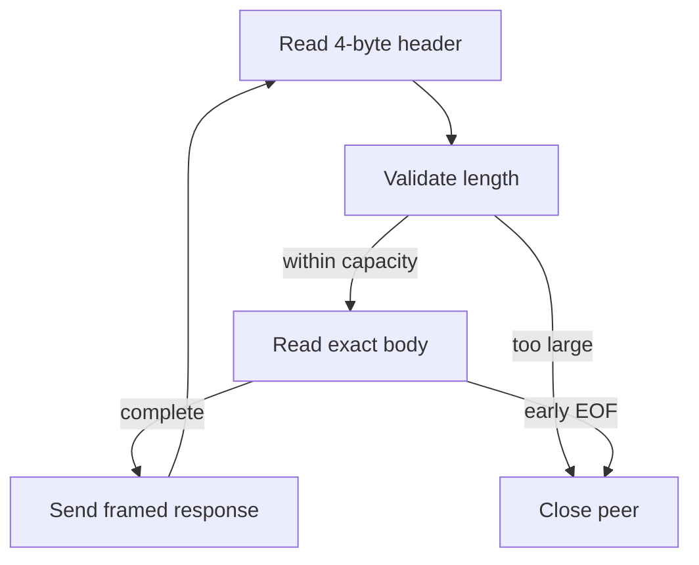

# Chapter 04 — Framing and interactive TCP

🟢 · [Course home](../README.md) · [Setup](../START_HERE.md)

## 🎯 Learning Objectives

Design bounded length-prefixed messages; handle split headers/bodies and coalesced frames; reuse a TCP connection for multiple exchanges.

## 🤔 Why Do We Need This?

TCP preserves byte order, not application message boundaries. A receiver needs a rule for how many bytes belong to each request.

## Further reading and labs

- [Protocol and parser architecture](architecture.md)

## 🧠 Concept

The course frame consists of a four-byte unsigned length in network byte order followed by exactly that many body bytes. If the header is 00 00 00 03, the body is three bytes. A receiver might obtain the header in several reads, or receive header and body together in one kernel buffer. Neither changes the protocol.

`recv_exact` loops until its target length is satisfied. EOF before any header bytes means the peer ended between messages; EOF halfway through a header/body is truncation. `frame_recv` validates the decoded length against both the buffer capacity and a 1 MiB protocol maximum before consuming the body.

A zero-length frame is valid and distinct from EOF. The interactive client sends each fgets chunk as one frame and waits for its echoed frame before reading the next input chunk. Long terminal lines can become several frames because its input buffer is 4096 bytes; the CLI is text-oriented even though the wire helper is binary-safe.

Read [common/net.c](../common/net.c) alongside this chapter. Shared functions implement visible socket, resolution and short-I/O loops. These blocking helpers are not used inside nonblocking event loops, where an EAGAIN result must preserve state for the next readiness event.

## 🏗️ Architecture



## 🔄 How It Works

Accept a peer; set operation timeouts; read exactly four header bytes; decode/check length; read exactly the body; echo the header and body; repeat until a clean boundary EOF.

## 🔧 Important Functions

`send_all`, `recv_exact`, `frame_send`, `frame_recv` from common/net.c; underlying `send`, `recv`, `htonl`, `ntohl`.

See the [API reference](../docs/socket-api.md) for signatures, parameters, returns,
examples and common mistakes. Shared helpers are explained in
[common/README.md](../common/README.md).

## 💻 Minimal Example

Read the complete, compilable [source](server.c). This is an opening excerpt
for orientation; compile the complete file using the command below:

```c
/* Step: The shared helpers below expose, rather than replace, the send/recv loops. */
int main(int argc, char **argv) {
    if (argc != 2) { fprintf(stderr, "usage: %s PORT\n", argv[0]); return 1; }
    net_init();
    int listener = net_listen("127.0.0.1", argv[1]);
    if (listener < 0) die("listen");
    unsigned char *buffer = malloc(COURSE_FRAME_MAX);
    if (!buffer) { close_fd(listener); die("malloc"); }
    printf("Framed echo on 127.0.0.1:%s\n", argv[1]); fflush(stdout);
    for (;;) {
        int peer = accept_retry(listener);
        if (peer < 0) { perror("accept"); break; }
        /* Step: A per-operation timeout bounds idle blocking, not total request duration. */
        if (set_timeout(peer, 15) < 0) { perror("timeout"); close_fd(peer); continue; }
```

## 🔍 Line-by-Line Explanation

Follow the [numbered source and walkthrough](../docs/walkthroughs/frame_server.md) alongside the program.
Each source block explains its purpose, underlying OS behavior, failure path and
an extension. Important socket operations also have individual entries in the
[API reference](../docs/socket-api.md). Trace variable lengths as carefully as
function names.

## ▶️ Compilation

From the repository root:

```bash
make build/frame_server build/frame_client
```

The [build/run catalogue](../docs/program-catalogue.md) gives a direct `cc` command
for every executable. You can use `make -j2` once to build all examples.

## ▶️ Execution

Run the marked terminal commands in separate terminals where applicable.

```bash
# Terminal A
./build/frame_server 9000
# Terminal B
printf "first message
second message
" | ./build/frame_client 127.0.0.1 9000
```

## 📤 Expected Output

```text
first message
second message
```

Values in angle brackets describe variable output; they are not recorded results.

## 🧪 Experiment

Run the fragmentation/coalescing integration test: `python3 tests/test_course.py CourseTests.test_06_fragmented_coalesced_and_empty_frames`. Inspect how it divides a header across send calls.

## 🛠️ Modify the Code

Add a one-byte message type inside each body and reject unknown types. Keep the outer length bound and document whether a reply must echo the type.

## 🐛 Common Errors

Sending a host-endian uint32; using strlen on a binary frame; trusting an advertised length before checking capacity; treating zero body length as socket EOF.

## 💡 Debugging Tips

Print the decoded length before reading the body. If a peer hangs, compare both sides' framing definitions and inspect whether all four header bytes arrived.

## 🎯 Practice Problems

- 🟢 **Beginner:** Encode a body of five bytes.
- 🟡 **Intermediate:** Send two frames in one write; why must the receiver still process two messages?
- 🔴 **Advanced:** What should happen after an oversized length is rejected?

Attempt these before opening [worked solutions](solutions.md).

## 📝 Exam Questions

**Question:** Describe three framing strategies and one trade-off each.

**Worked answer:** Fixed size is simple but inflexible; delimiters need escaping or restricted payloads; a length prefix supports binary data but needs length validation and truncation handling.

## 🎤 Viva Questions

**Question:** Is a zero-length frame the same as recv returning zero?

**Worked answer:** No. One is an application record parsed from a header; the other can signal TCP EOF for a positive receive length.

## 💼 Interview Questions

**Question:** Why is MSG_WAITALL not a complete framing implementation?

**Worked answer:** It does not validate a protocol length and can still return early on conditions such as EOF, errors or signals. You must inspect the actual result.

## 🚀 Mini Project

Build a framed arithmetic service with a documented text body such as ADD 2 3. Reject malformed requests and reply with explicit error frames; never eval arbitrary input.

Record your prediction, commands, output and explanation using the
[lab notebook](../docs/lab-notebook.md). The [solutions](solutions.md) include an
acceptance checklist for this extension.

## ✅ Chapter Summary

A wire protocol defines message boundaries. Short I/O, valid empty records, capacity checks and truncated records must all have different meanings.

## ➡️ Next Chapter

Continue to [Chapter 05 — UDP and broadcast](../05-udp-programming/README.md).
