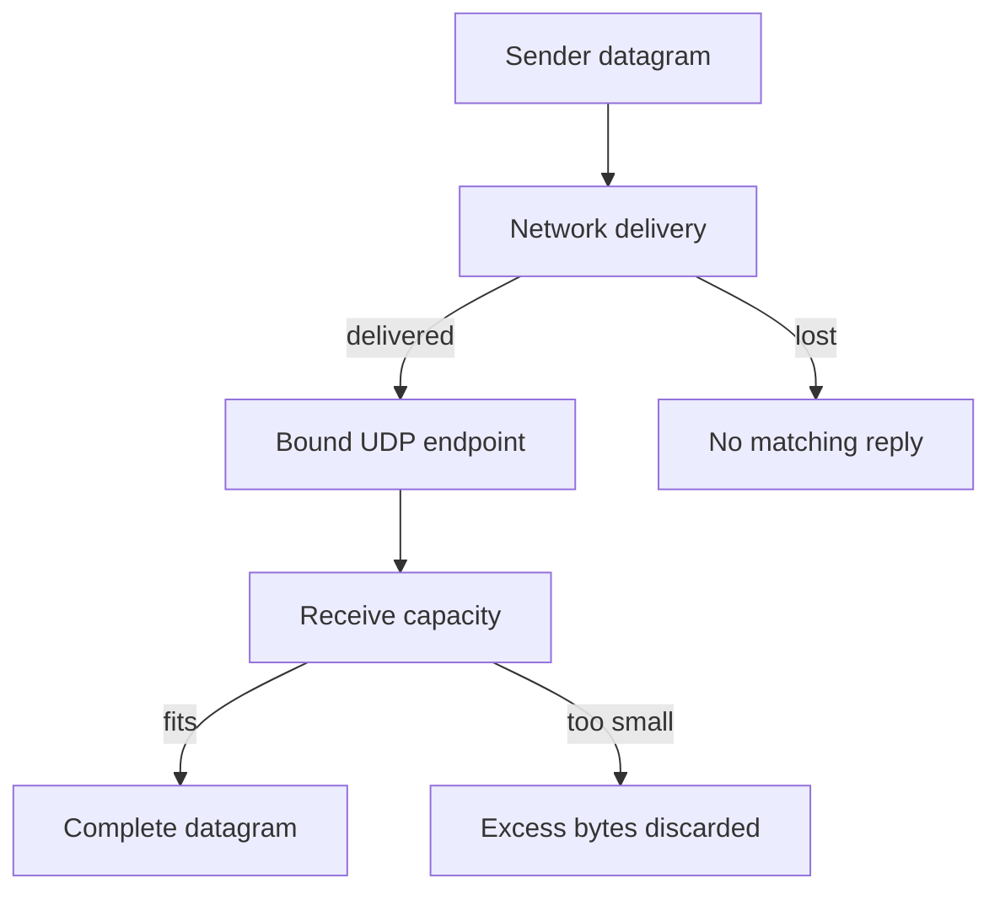

# Chapter 05 — UDP and broadcast

🟢 · [Course home](../README.md) · [Setup](../START_HERE.md)

## 🎯 Learning Objectives

Send and receive datagrams; explain UDP loss/reordering/truncation; use explicit destinations, timeouts and SO_BROADCAST.

## 🤔 Why Do We Need This?

Some applications need independent small messages rather than a reliable stream. UDP lets the application choose its own delivery policy, while retaining datagram boundaries.

## Further reading and labs

- [Manual broadcast experiment](broadcast-lab.md)
- [TCP and UDP comparison](tcp-vs-udp.md)

## 🧠 Concept

UDP sends messages called datagrams. A successful sendto queues a datagram locally; it is not a receipt from the peer. Messages can be lost, reordered or duplicated. No listen or accept call is used. The receiver obtains a sender address from recvfrom and can reply using sendto.

A receive consumes one datagram. If the supplied buffer is too small, the remainder of that datagram is discarded rather than becoming the next read. A zero-length UDP datagram is valid, so recvfrom returning zero is not a stream EOF signal. The supplied receiver uses a large buffer; the beginner client caps outbound messages at 1200 bytes to keep the exercise small, not as a universal MTU guarantee.

UDP connect selects a default peer and affects received-source filtering and error reporting. It does not conduct a TCP-style handshake or add reliability. The chat project uses this form; the echo client explicitly calls sendto and checks the returned sender endpoint.

IPv4 broadcast requires SO_BROADCAST for broadcast destinations. Send one message only to a lab network you control. Broadcast routing and reception depend on the host interface, virtual network and firewall; WSL or container networking may not expose LAN broadcast. IPv6 uses multicast rather than IPv4 broadcast.

## 🏗️ Architecture



## 🔄 How It Works

Server binds a datagram socket; client sends one small message; server receives one datagram plus its source; server replies to that source; client checks reply or times out.

## 🔧 Important Functions

`socket(..., SOCK_DGRAM, ...)`, `bind`, `sendto`, `recvfrom`, `setsockopt(SO_BROADCAST)`, `SO_RCVTIMEO`.

See the [API reference](../docs/socket-api.md) for signatures, parameters, returns,
examples and common mistakes. Shared helpers are explained in
[common/README.md](../common/README.md).

## 💻 Minimal Example

Read the complete, compilable [source](udp-server.c). This is an opening excerpt
for orientation; compile the complete file using the command below:

```c
/* Step: UDP binds an endpoint but never calls listen or accept. */
int main(int argc, char **argv) {
    if (argc != 2) { fprintf(stderr, "usage: %s PORT\n", argv[0]); return 1; }
    int fd = net_bound("127.0.0.1", argv[1], SOCK_DGRAM);
    if (fd < 0) die("bind UDP");
    printf("UDP echo on 127.0.0.1:%s\n", argv[1]); fflush(stdout);
    for (;;) {
        unsigned char data[65536];
        struct sockaddr_storage peer;
        socklen_t length = sizeof peer;
        /* Step: Reinitialize length on every receive; even zero bytes is a valid datagram. */
        ssize_t n = recvfrom(fd, data, sizeof data, 0, (struct sockaddr *)&peer, &length);
        if (n < 0 && errno == EINTR) continue;
        if (n < 0) { perror("recvfrom"); break; }
```

## 🔍 Line-by-Line Explanation

Follow the [numbered source and walkthrough](../docs/walkthroughs/udp_server.md) alongside the program.
Each source block explains its purpose, underlying OS behavior, failure path and
an extension. Important socket operations also have individual entries in the
[API reference](../docs/socket-api.md). Trace variable lengths as carefully as
function names.

## ▶️ Compilation

From the repository root:

```bash
make build/udp_server build/udp_client
```

The [build/run catalogue](../docs/program-catalogue.md) gives a direct `cc` command
for every executable. You can use `make -j2` once to build all examples.

## ▶️ Execution

Run the marked terminal commands in separate terminals where applicable.

```bash
# Terminal A
./build/udp_server 9001
# Terminal B
./build/udp_client 127.0.0.1 9001 "one datagram"
```

## 📤 Expected Output

```text
one datagram
```

Values in angle brackets describe variable output; they are not recorded results.

## 🧪 Experiment

Run the empty-datagram test and compare it with TCP EOF. Stop the server and rerun the UDP client; a missing reply must not be mistaken for successful delivery.

## 🛠️ Modify the Code

Prefix each datagram with a sequence number and print gaps/repeats. Do not automatically retransmit until you define duplicate suppression and a retry limit.

## 🐛 Common Errors

Assuming UDP is guaranteed to be faster; expecting a truncated datagram remainder on the next recv; forgetting to initialize source-address length; assuming source IP authenticates the sender.

## 💡 Debugging Tips

Use `ss -lunp` for UDP sockets. Inspect actual datagram lengths and sender address/port. A listening TCP port with the same number is a different endpoint.

## 🎯 Practice Problems

- 🟢 **Beginner:** Explain why UDP echo does not call accept.
- 🟡 **Intermediate:** Use a 4-byte receive buffer with an 8-byte datagram. What remains?
- 🔴 **Advanced:** Design an idempotent UDP temperature query with a bounded retry policy.

Attempt these before opening [worked solutions](solutions.md).

## 📝 Exam Questions

**Question:** Compare TCP stream boundaries and UDP datagram boundaries.

**Worked answer:** TCP preserves order of bytes but not writes; UDP preserves each datagram as a message but offers no in-protocol delivery/reordering guarantee.

## 🎤 Viva Questions

**Question:** Can recvfrom return zero while the socket is healthy?

**Worked answer:** Yes, it can receive a zero-length datagram.

## 💼 Interview Questions

**Question:** Does calling connect on a UDP socket establish a remote connection?

**Worked answer:** No TCP-like establishment occurs. It configures the local socket's peer-related behavior.

## 🚀 Mini Project

Build a sequence-numbered UDP echo monitor reporting sent IDs, received IDs and local RTT only for matched responses. Label missing replies as missing, not as measured one-way loss.

Record your prediction, commands, output and explanation using the
[lab notebook](../docs/lab-notebook.md). The [solutions](solutions.md) include an
acceptance checklist for this extension.

## ✅ Chapter Summary

UDP message boundaries survive, delivery does not become guaranteed, and application reliability requires explicit protocol design.

## ➡️ Next Chapter

Continue to [Chapter 06 — Serving multiple clients](../06-multiple-client-server/README.md).
