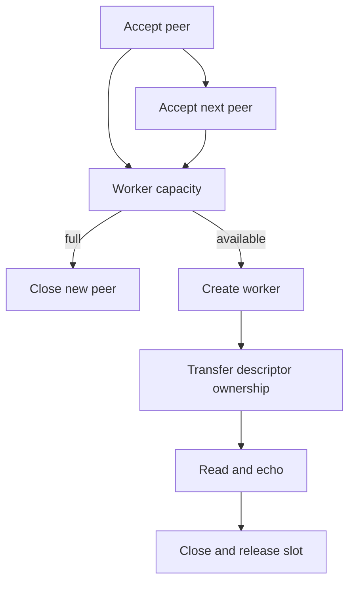

# Chapter 06 — Serving multiple clients

🟡 · [Course home](../README.md) · [Setup](../START_HERE.md)

## 🎯 Learning Objectives

Compare sequential, process-per-client and thread-per-client service; transfer ownership correctly; bound concurrency.

## 🤔 Why Do We Need This?

An iterative server can be held up by one idle peer. Serving multiple clients requires deciding what work can proceed independently and what resources are shared.

## Further reading and labs

- [Iterative server](iterative-server/README.md)
- [Fork server](fork-server/README.md)
- [Thread server](thread-server/README.md)

## 🧠 Concept

An iterative server returns to accept only after finishing a peer. Additional established clients may wait in queues, but their application data is not handled yet. This is simple and useful for small experiments; it exposes head-of-line blocking at the application level.

A fork server creates a child process for each accepted peer. Parent and child initially inherit references to the same descriptors, but normally have separate private address spaces. The parent closes its connected descriptor; the child closes its listening descriptor. The parent periodically reaps completed children with waitpid to avoid zombies and tracks a 64-child admission limit.

A thread server creates a detached worker with shared memory and a shared descriptor table. The accepted descriptor is passed through a separate heap allocation, preventing the address-of-loop-variable race. Only the worker closes that connection. A mutex protects active-worker accounting, and the program caps workers at 64.

There is no universal fastest model. Processes offer stronger memory isolation but carry process-management costs; threads simplify per-connection blocking code but require synchronization; readiness loops avoid one blocking stack per client but require explicit parser/output state. Compare correctness and workload before discussing measurements.

## 🏗️ Architecture



## 🔄 How It Works

Accept a peer; check the active-worker limit; allocate a per-worker argument; start a detached thread; worker serves/cleans up; decrement the protected count.

## 🔧 Important Functions

`fork`, `waitpid`, `pthread_create`, `pthread_attr_setdetachstate`, `pthread_mutex_lock`, `pthread_mutex_unlock`; POSIX thread functions return error codes directly.

See the [API reference](../docs/socket-api.md) for signatures, parameters, returns,
examples and common mistakes. Shared helpers are explained in
[common/README.md](../common/README.md).

## 💻 Minimal Example

Read the complete, compilable [source](thread-server/server.c). This is an opening excerpt
for orientation; compile the complete file using the command below:

```c
/* Step: Threads share descriptors and memory. Protect only shared metadata with the mutex. */
static pthread_mutex_t lock = PTHREAD_MUTEX_INITIALIZER;
static unsigned active;
static void check(int code, const char *what) {
    if (code) { fprintf(stderr, "%s: %s\n", what, strerror(code)); exit(1); }
}
static void *serve(void *argument) {
    int fd = *(int *)argument; free(argument);
    if (set_timeout(fd, 15) < 0 || echo_connection(fd) < 0) perror("thread echo");
    close_fd(fd);
    check(pthread_mutex_lock(&lock), "lock");
    --active;
    check(pthread_mutex_unlock(&lock), "unlock");
    return NULL;
```

## 🔍 Line-by-Line Explanation

Follow the [numbered source and walkthrough](../docs/walkthroughs/thread_server.md) alongside the program.
Each source block explains its purpose, underlying OS behavior, failure path and
an extension. Important socket operations also have individual entries in the
[API reference](../docs/socket-api.md). Trace variable lengths as carefully as
function names.

## ▶️ Compilation

From the repository root:

```bash
make build/thread_server
```

The [build/run catalogue](../docs/program-catalogue.md) gives a direct `cc` command
for every executable. You can use `make -j2` once to build all examples.

## ▶️ Execution

Run the marked terminal commands in separate terminals where applicable.

```bash
# Terminal A
./build/thread_server 9000
# Terminal B
python3 11-real-world-projects/concurrent-network-server/load_test.py --port 9000 --clients 8
```

## 📤 Expected Output

```text
8 correct replies; local mean roundtrip=<measured on your machine> ms
```

Values in angle brackets describe variable output; they are not recorded results.

## 🧪 Experiment

Keep one client connected but silent, then start another. Compare iterative_server, fork_server and thread_server. The iterative version delays service until the first peer closes or its receive times out.

## 🛠️ Modify the Code

Make the worker limit a validated CLI parameter with a conservative upper bound. Log accepted, active, completed and rejected counts without keeping the mutex locked during network I/O.

## 🐛 Common Errors

Leaving the parent's connected descriptor open after fork; never reaping children; passing &peer from the accept loop to a thread; locking shared state while blocking on recv.

## 💡 Debugging Tips

Inspect processes with ps, threads with `ps -T -p PID`, and descriptors with `ls /proc/PID/fd`. Substitute the server PID shown by ss.

## 🎯 Practice Problems

- 🟢 **Beginner:** Which unused socket does the forked child close?
- 🟡 **Intermediate:** Why is &peer from the accept loop unsafe as a thread argument?
- 🔴 **Advanced:** What happens when the worker limit is reached?

Attempt these before opening [worked solutions](solutions.md).

## 📝 Exam Questions

**Question:** Compare process and thread descriptor ownership.

**Worked answer:** A fork gives each process its own descriptor table with shared underlying references; closing the parent copy does not close the child copy. Threads share one table, so a close is visible to all threads.

## 🎤 Viva Questions

**Question:** Why call waitpid?

**Worked answer:** To collect child exit status and release zombie process bookkeeping.

## 💼 Interview Questions

**Question:** Why does pthread_create use strerror(code), not necessarily perror?

**Worked answer:** POSIX thread APIs return an error number directly; they do not use the usual -1 plus errno convention.

## 🚀 Mini Project

Build a concurrent echo service with a configurable worker cap and an overload counter. Demonstrate that one idle client does not prevent a second client receiving an echo.

Record your prediction, commands, output and explanation using the
[lab notebook](../docs/lab-notebook.md). The [solutions](solutions.md) include an
acceptance checklist for this extension.

## ✅ Chapter Summary

Choose a concurrency model deliberately. Correct ownership, resource limits and cleanup matter before throughput.

## ➡️ Next Chapter

Continue to [Chapter 07 — Processes, threads and synchronization](../07-concurrent-programming/README.md).
