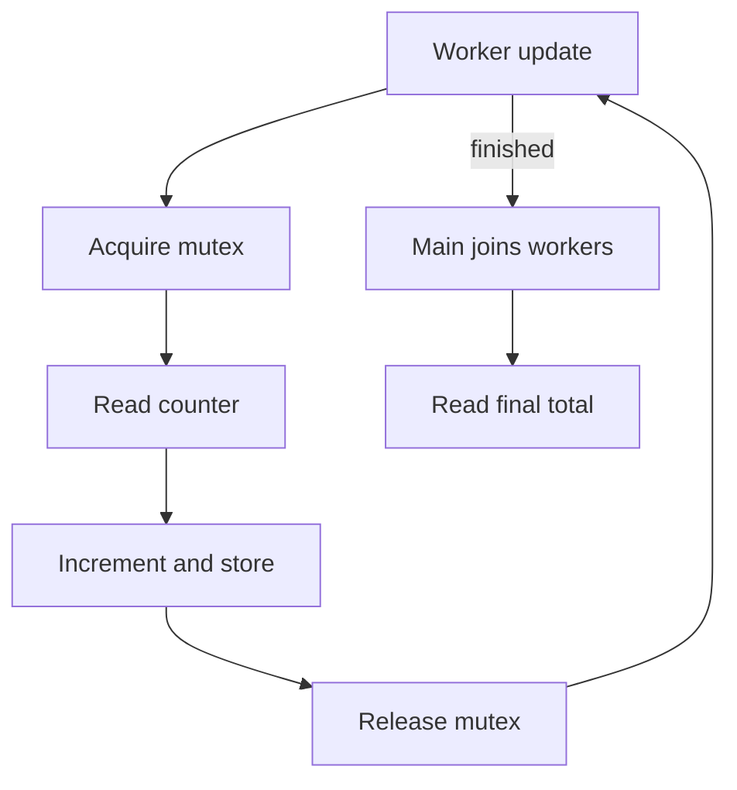

# Chapter 07 — Processes, threads and synchronization

🟡 · [Course home](../README.md) · [Setup](../START_HERE.md)

## 🎯 Learning Objectives

Explain process-private versus shared thread memory; use join for lifetime; protect a read-modify-write operation with a mutex.

## 🤔 Why Do We Need This?

Socket servers often share counters, chat-room membership or queues. A network program can compile and appear correct while still containing undefined behavior from a data race.

## Further reading and labs

- [Process memory](processes/README.md)
- [Thread lifetime](threads/README.md)
- [Synchronization](synchronization/README.md)

## 🧠 Concept

After fork, parent and child have separate private virtual-memory views. A child assigning value=99 does not assign the parent's ordinary local variable. Shared-memory mappings are a separate mechanism, not a consequence of the variable having the same address.

Threads in one process share memory. The thread demonstration safely passes a local variable because main keeps it alive and waits with pthread_join before reading the worker's result. The worker and main are not concurrently accessing it without coordination.

`counter++` combines a load, addition and store. Two unsynchronized threads accessing it with at least one write form a C data race, which has undefined behavior; the problem is not merely that a particular total will be too small. A mutex makes the increment a protected critical section. `volatile` does not replace synchronization.

Keep critical sections short. Holding a global lock while a client blocks on network I/O serializes other workers and can amplify failures. Protect shared bookkeeping, copy needed values, release the lock, then perform potentially slow I/O under a clearly defined ownership model.

## 🏗️ Architecture



## 🔄 How It Works

Create four joinable workers; each locks, increments and unlocks 100000 times; join all workers; inspect the final count; destroy the mutex.

## 🔧 Important Functions

`pthread_create`, `pthread_join`, `pthread_mutex_lock`, `pthread_mutex_unlock`, `pthread_mutex_destroy`, `fork`, `waitpid`.

See the [API reference](../docs/socket-api.md) for signatures, parameters, returns,
examples and common mistakes. Shared helpers are explained in
[common/README.md](../common/README.md).

## 💻 Minimal Example

Read the complete, compilable [source](synchronization/counter.c). This is an opening excerpt
for orientation; compile the complete file using the command below:

```c
/* Step: Increment is read-modify-write, so all threads must hold the same mutex. */
static pthread_mutex_t lock = PTHREAD_MUTEX_INITIALIZER;
static unsigned counter;
static void check(int code) { if (code) { fprintf(stderr, "%s\n", strerror(code)); exit(1); } }
static void *increment(void *unused) {
    (void)unused;
    for (unsigned i = 0; i < 100000; ++i) {
        check(pthread_mutex_lock(&lock));
        ++counter;
        check(pthread_mutex_unlock(&lock));
    }
    return NULL;
}
int main(void) {
```

## 🔍 Line-by-Line Explanation

Follow the [numbered source and walkthrough](../docs/walkthroughs/counter.md) alongside the program.
Each source block explains its purpose, underlying OS behavior, failure path and
an extension. Important socket operations also have individual entries in the
[API reference](../docs/socket-api.md). Trace variable lengths as carefully as
function names.

## ▶️ Compilation

From the repository root:

```bash
make build/counter
```

The [build/run catalogue](../docs/program-catalogue.md) gives a direct `cc` command
for every executable. You can use `make -j2` once to build all examples.

## ▶️ Execution

Run the marked terminal commands in separate terminals where applicable.

```bash
./build/fork_demo
./build/thread_demo
./build/counter
```

## 📤 Expected Output

```text
child value=99
parent value=7
shared value=99
counter=400000 expected=400000
```

Values in angle brackets describe variable output; they are not recorded results.

## 🧪 Experiment

Run all three examples and draw which variables are shared. If you temporarily remove a mutex in a private experiment, do not conclude correctness from one apparently correct total.

## 🛠️ Modify the Code

Give each worker a private counter and combine the results after joining. Compare how this removes shared increments from the hot loop while retaining a deterministic total.

## 🐛 Common Errors

Using volatile as a lock; returning while a worker still refers to a stack variable; joining a detached thread; acquiring multiple locks in inconsistent order.

## 💡 Debugging Tips

Record each shared variable, its owner and protecting lock. Ask whether there is a happens-before relationship before trusting an observation.

## 🎯 Practice Problems

- 🟢 **Beginner:** Why does the parent print 7 in fork-demo?
- 🟡 **Intermediate:** Is the thread-demo assignment safe without a mutex?
- 🔴 **Advanced:** Two chat operations acquire user-lock and room-lock in opposite orders. What is the fix?

Attempt these before opening [worked solutions](solutions.md).

## 📝 Exam Questions

**Question:** Explain race condition versus data race.

**Worked answer:** A race condition is broader incorrect dependence on timing; a C data race is conflicting unsynchronized memory access involving a write and invokes undefined behavior.

## 🎤 Viva Questions

**Question:** Does volatile make counter++ atomic?

**Worked answer:** No.

## 💼 Interview Questions

**Question:** When might per-worker counters be better than a global mutex-protected counter?

**Worked answer:** When frequent updates need not be immediately globally visible. Local accumulation and a synchronized merge can reduce contention, with explicit snapshot semantics.

## 🚀 Mini Project

Create a small worker group that computes per-connection byte totals locally and merges them under a mutex only when a connection finishes.

Record your prediction, commands, output and explanation using the
[lab notebook](../docs/lab-notebook.md). The [solutions](solutions.md) include an
acceptance checklist for this extension.

## ✅ Chapter Summary

Use ownership and synchronization to make memory access correct. Do not rely on timing, volatile, or lucky output.

## ➡️ Next Chapter

Continue to [Chapter 08 — select, poll and epoll](../08-io-multiplexing/README.md).
