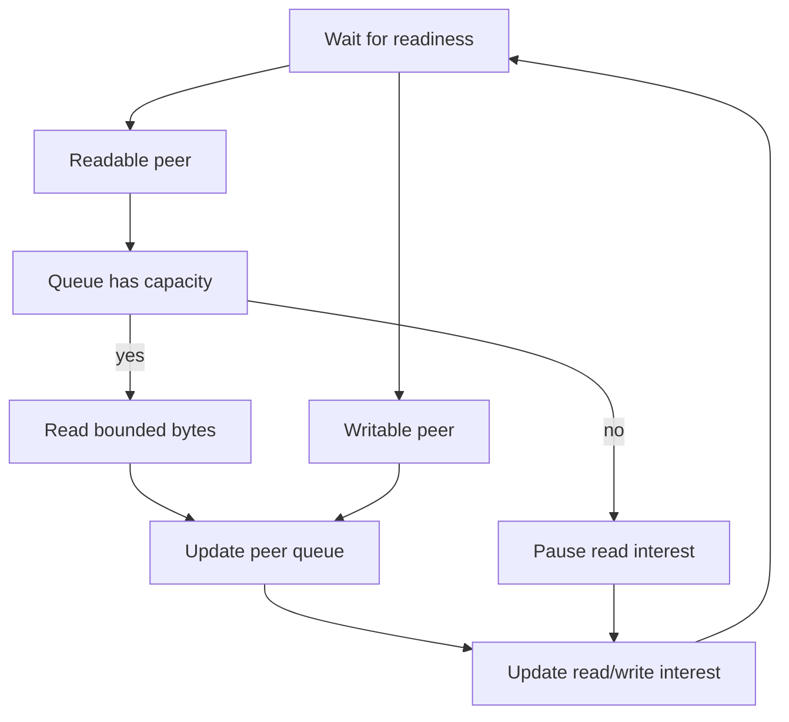

# Chapter 08 — select, poll and epoll

🔴 · [Course home](../README.md) · [Setup](../START_HERE.md)

## 🎯 Learning Objectives

Use readiness APIs without blocking the entire server; preserve partial-write state; apply backpressure and drain replies after a peer half-close.

## 🤔 Why Do We Need This?

Many connections spend most of their time idle. A readiness loop can serve them using one application thread, provided every network operation is nonblocking and connection state persists between events.

## Further reading and labs

- [select lab](select/README.md)
- [poll lab](poll/README.md)
- [epoll lab](epoll/README.md)
- [Scalability and backpressure](scalability.md)

## 🧠 Concept

Readiness means an I/O operation can make progress or report a condition without waiting at that instant. It does not promise that a complete application message is available. EOF and errors can also produce readiness. Because state can change, nonblocking calls must still handle EAGAIN/EWOULDBLOCK.

select uses descriptor bit sets that it modifies. Rebuild the sets each iteration, pass largest_fd+1 and reject descriptors outside FD_SETSIZE before using FD_SET. poll uses an array with requested events and returned revents; negative descriptor slots are ignored. Both APIs require application-side scanning of the monitored sets/arrays.

epoll maintains a kernel interest list and returns ready events. This course uses epoll_create1 and level triggering. Add a client with EPOLL_CTL_ADD, update its read/write interest with MOD and remove it with DEL before closing. The batch of old client events is processed before new clients receive freed slots, preventing slot reuse from confusing that batch.

The shared connection state holds a 16 KiB output queue. Read only when queue capacity is available; write only when data is queued. A short send removes only its prefix. After recv returns zero, stop reading but keep writable interest until queued replies drain. No event loop calls blocking send_all. Edge-triggered operation would additionally require a disciplined drain/rearm strategy; merely adding EPOLLET to this level-triggered code is incorrect.

## 🏗️ Architecture



## 🔄 How It Works

Rebuild or update interests; wait for readiness; make bounded progress on each current peer; preserve unsent bytes; close only finished/failed peers; accept one new peer; repeat.

## 🔧 Important Functions

`select`, `poll`, `epoll_create1`, `epoll_ctl`, `epoll_wait`, `fcntl(O_NONBLOCK)`; shared state operations in common/reactor.h.

See the [API reference](../docs/socket-api.md) for signatures, parameters, returns,
examples and common mistakes. Shared helpers are explained in
[common/README.md](../common/README.md).

## 💻 Minimal Example

Read the complete, compilable [source](poll/server.c). This is an opening excerpt
for orientation; compile the complete file using the command below:

```c
/* Step: poll uses an array of descriptor/event pairs; negative descriptors are ignored. */
int main(int argc, char **argv) {
    if (argc != 2) { fprintf(stderr, "usage: %s PORT\n", argv[0]); return 1; }
    net_init(); int listener = net_listen("127.0.0.1", argv[1]);
    if (listener < 0) die("listen");
    if (nonblocking(listener) < 0) { close_fd(listener); die("nonblocking"); }
    static struct connection clients[REACTOR_CLIENTS];
    for (int i = 0; i < REACTOR_CLIENTS; ++i) clients[i].fd = -1;
    printf("poll echo on %s\n", argv[1]); fflush(stdout);
    for (;;) {
        struct pollfd events[REACTOR_CLIENTS + 1] = {0};
        events[0].fd = listener; events[0].events = POLLIN;
        for (int i = 0; i < REACTOR_CLIENTS; ++i) {
            events[i + 1].fd = clients[i].fd;
```

## 🔍 Line-by-Line Explanation

Follow the [numbered source and walkthrough](../docs/walkthroughs/poll_server.md) alongside the program.
Each source block explains its purpose, underlying OS behavior, failure path and
an extension. Important socket operations also have individual entries in the
[API reference](../docs/socket-api.md). Trace variable lengths as carefully as
function names.

## ▶️ Compilation

From the repository root:

```bash
make build/poll_server build/tcp_client
```

The [build/run catalogue](../docs/program-catalogue.md) gives a direct `cc` command
for every executable. You can use `make -j2` once to build all examples.

## ▶️ Execution

Run the marked terminal commands in separate terminals where applicable.

```bash
# Terminal A (choose select_server, poll_server or epoll_server)
./build/poll_server 9000
# Terminal B
./build/tcp_client 127.0.0.1 9000 "event loop"
python3 11-real-world-projects/concurrent-network-server/load_test.py --port 9000 --clients 16
```

## 📤 Expected Output

```text
event loop
16 correct replies; local mean roundtrip=<measured> ms
```

Values in angle brackets describe variable output; they are not recorded results.

## 🧪 Experiment

Run the slow-reader integration test. Fill one peer's echo path while another requests a short echo; the second should continue making progress.

## 🛠️ Modify the Code

Add an idle timestamp to each connection and an expiry pass. Use a finite wait timeout derived from the next deadline; describe whether queued output extends the idle budget.

## 🐛 Common Errors

Registering POLLOUT/EPOLLOUT all the time and spinning; using blocking send_all inside the loop; closing on HUP before reading buffered bytes; calling FD_SET on a descriptor >= FD_SETSIZE.

## 💡 Debugging Tips

Log queue size and requested events for one connection. A writable event with an empty queue suggests unnecessary interest; a full output queue should suppress more input reads.

## 🎯 Practice Problems

- 🟢 **Beginner:** Why must select sets be rebuilt?
- 🟡 **Intermediate:** A send returns 100 for a 500-byte queue. What state remains?
- 🔴 **Advanced:** Why cannot this code enable EPOLLET unchanged?

Attempt these before opening [worked solutions](solutions.md).

## 📝 Exam Questions

**Question:** Compare select, poll and epoll without claiming one is always faster.

**Worked answer:** select uses bounded descriptor bit sets; poll uses arrays without that bit-set descriptor-number limit; Linux epoll maintains registered interest and returns ready events. Workload, registration churn and application work affect measured performance.

## 🎤 Viva Questions

**Question:** Can a readable socket return zero from recv?

**Worked answer:** Yes. Read readiness can indicate orderly EOF.

## 💼 Interview Questions

**Question:** What prevents a slow reader from exhausting server memory?

**Worked answer:** A bounded output queue plus a policy: stop consuming more input to propagate backpressure or drop the peer. Unbounded queues postpone the failure while increasing memory use.

## 🚀 Mini Project

Add monotonic idle deadlines to the poll server and verify that an idle slot expires while active peers continue receiving replies.

Record your prediction, commands, output and explanation using the
[lab notebook](../docs/lab-notebook.md). The [solutions](solutions.md) include an
acceptance checklist for this extension.

## ✅ Chapter Summary

Readiness loops are state machines. Preserve partial progress and control both input and output interest.

## ➡️ Next Chapter

Continue to [Chapter 09 — Nonblocking I/O, timeouts and IPv6](../09-advanced-sockets/README.md).
