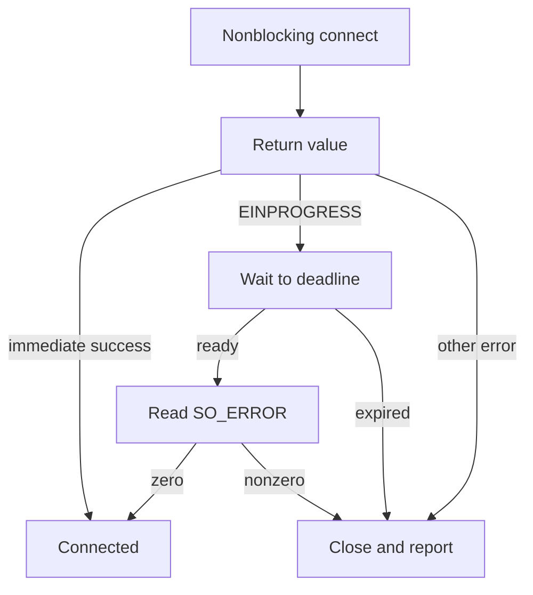

# Chapter 09 — Nonblocking I/O, timeouts and IPv6

🔴 · [Course home](../README.md) · [Setup](../START_HERE.md)

## 🎯 Learning Objectives

Distinguish nonblocking mode, socket timeouts and deadlines; inspect connect completion with SO_ERROR; run IPv6 and socket-option examples.

## 🤔 Why Do We Need This?

Failures are often timing-dependent. A robust application must decide how long to wait, how to resume partial work, and how to distinguish “not ready yet” from “failed.”

## Further reading and labs

- [Nonblocking connect](blocking-vs-nonblocking/README.md)
- [Options](socket-options/README.md)
- [Timeouts](timeouts/README.md)
- [Error handling](error-handling/README.md)
- [IPv6](ipv6/README.md)

## 🧠 Concept

A blocking call may wait in the kernel. O_NONBLOCK changes socket I/O to report EAGAIN/EWOULDBLOCK when progress would otherwise wait. It does not make the application asynchronous by itself; the application must preserve progress and wait for readiness efficiently.

A nonblocking TCP connect commonly reports EINPROGRESS. Wait for completion readiness, then retrieve SO_ERROR. Writability alone is not proof of success. The connect example uses CLOCK_MONOTONIC to calculate a three-second overall deadline and recomputes remaining time after an interrupted poll.

SO_RCVTIMEO and SO_SNDTIMEO bound individual blocking operations, not an entire multi-call transaction. Time already spent in DNS or another call is outside that operation's budget. If a timeout occurs after some bytes transfer, the result may be a positive partial count. The isolated timeout demo uses socketpair so a known-open peer sends nothing.

SO_KEEPALIVE enables transport-level probing governed by OS timing; it is not an immediate application health check. getsockopt reports effective socket settings, which need not match naive assumptions about requested buffer sizes. IPv6 uses sockaddr_in6 and ::1. The generic helper resolves address candidates using getaddrinfo, while the IPv6 listener explicitly requests IPv6-only behavior.

## 🏗️ Architecture



## 🔄 How It Works

Parse a numeric endpoint; preserve flags while enabling nonblocking; attempt connect; handle immediate completion or EINPROGRESS; poll until deadline; retrieve SO_ERROR; report success or failure; close.

## 🔧 Important Functions

`fcntl`, `poll`, `getsockopt(SO_ERROR)`, `clock_gettime`, `setsockopt`, `getaddrinfo`, `freeaddrinfo`, `socketpair`.

See the [API reference](../docs/socket-api.md) for signatures, parameters, returns,
examples and common mistakes. Shared helpers are explained in
[common/README.md](../common/README.md).

## 💻 Minimal Example

Read the complete, compilable [source](blocking-vs-nonblocking/connect.c). This is an opening excerpt
for orientation; compile the complete file using the command below:

```c
/* Step: A monotonic deadline survives wall-clock changes and repeated signal interruptions. */
static long long milliseconds(void) {
    struct timespec now;
    if (clock_gettime(CLOCK_MONOTONIC, &now) < 0) die("clock_gettime");
    return (long long)now.tv_sec * 1000 + now.tv_nsec / 1000000;
}
int main(int argc, char **argv) {
    if (argc != 3 || !valid_port(argv[2])) { fprintf(stderr, "usage: %s IPv4 PORT\n", argv[0]); return 1; }
    struct sockaddr_in address = {0}; address.sin_family = AF_INET;
    address.sin_port = htons((uint16_t)strtoul(argv[2], NULL, 10));
    if (inet_pton(AF_INET, argv[1], &address.sin_addr) != 1) return 1;
    int fd = socket(AF_INET, SOCK_STREAM, 0), status = 1;
    if (fd < 0) die("socket");
    if (nonblocking(fd) < 0) { perror("fcntl"); goto done; }
```

## 🔍 Line-by-Line Explanation

Follow the [numbered source and walkthrough](../docs/walkthroughs/connect_timeout.md) alongside the program.
Each source block explains its purpose, underlying OS behavior, failure path and
an extension. Important socket operations also have individual entries in the
[API reference](../docs/socket-api.md). Trace variable lengths as carefully as
function names.

## ▶️ Compilation

From the repository root:

```bash
make build/connect_timeout build/iterative_server build/socket_options build/receive_timeout build/broken_pipe build/ipv6_server build/ipv6_client
```

The [build/run catalogue](../docs/program-catalogue.md) gives a direct `cc` command
for every executable. You can use `make -j2` once to build all examples.

## ▶️ Execution

Run the marked terminal commands in separate terminals where applicable.

```bash
# Terminal A
./build/iterative_server 9000
# Terminal B
./build/connect_timeout 127.0.0.1 9000
./build/socket_options
./build/receive_timeout
./build/broken_pipe
# Separate IPv6 experiment: terminal A
./build/ipv6_server 9002
# Terminal B
./build/ipv6_client ::1 9002 "IPv6 hello"
```

## 📤 Expected Output

```text
Connected before the 3 second deadline
SO_KEEPALIVE=1
SO_RCVBUF=<host-dependent>
Receive timed out; peer is still open
EPIPE handled without termination
IPv6 hello
```

Values in angle brackets describe variable output; they are not recorded results.

## 🧪 Experiment

Connect to a closed loopback port and confirm that completion readiness can correspond to ECONNREFUSED. Run the IPv6 case only if ::1 is available.

## 🛠️ Modify the Code

Extend the connect demo with a validated deadline argument. Keep all calculations monotonic and never reset the entire budget after EINTR.

## 🐛 Common Errors

Treating EINPROGRESS as immediate success; overwriting existing fcntl flags; assuming timeout means peer closure; using perror for getaddrinfo's EAI error code; assuming IPv6 listeners are universally dual-stack.

## 💡 Debugging Tips

Print SO_ERROR after a connect event. Record start/deadline/remaining times if timeout behavior surprises you; compare complete-operation duration rather than counting poll calls.

## 🎯 Practice Problems

- 🟢 **Beginner:** What is the difference between EAGAIN and EOF?
- 🟡 **Intermediate:** Why use CLOCK_MONOTONIC for elapsed deadlines?
- 🔴 **Advanced:** A hostname-based client must finish within 2 s. Does this connect demo solve that whole problem?

Attempt these before opening [worked solutions](solutions.md).

## 📝 Exam Questions

**Question:** Explain why repeated 1-second receive timeouts do not guarantee a 1-second request budget.

**Worked answer:** Each call has its own wait bound and successful partial progress can lead to more calls. Track an absolute deadline across the complete request if that is the requirement.

## 🎤 Viva Questions

**Question:** Which option confirms nonblocking connect completion status?

**Worked answer:** SO_ERROR, read with getsockopt.

## 💼 Interview Questions

**Question:** Should EINTR from Linux close simply be retried?

**Worked answer:** No. Linux releases the descriptor early; retry can close a different resource if the number was reused. Follow the platform's close semantics explicitly.

## 🚀 Mini Project

Build a deadline-aware framed request client whose DNS/address assumptions are explicit and whose header/body exchange shares one overall budget.

Record your prediction, commands, output and explanation using the
[lab notebook](../docs/lab-notebook.md). The [solutions](solutions.md) include an
acceptance checklist for this extension.

## ✅ Chapter Summary

Blocking mode, per-call timeouts and end-to-end deadlines solve different problems. Completion readiness still requires checking the operation result.

## ➡️ Next Chapter

Continue to [Chapter 10 — Network debugging laboratory](../10-network-debugging/README.md).
