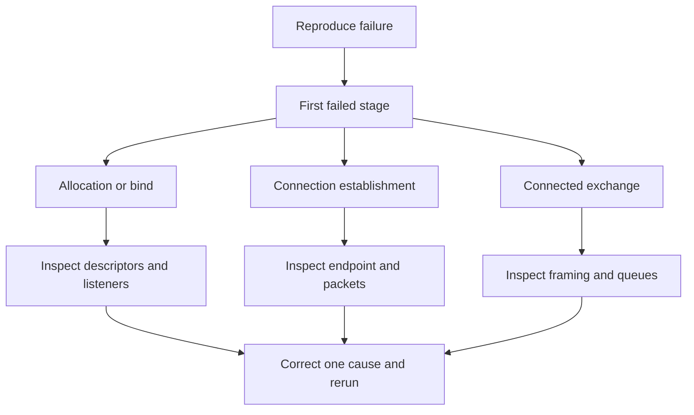

# Chapter 10 — Network debugging laboratory

🟡 · [Course home](../README.md) · [Setup](../START_HERE.md)

## 🎯 Learning Objectives

Use socket tables, system-call traces and packet captures to locate a failure; separate endpoint, transport and application-protocol evidence.

## 🤔 Why Do We Need This?

Changing code at random can mask the real failure. Debugging should identify the first layer whose observed behavior disagrees with the program's prediction.

## Further reading and labs

- [Error playbook](error-playbook.md)
- [ss](ss/README.md)
- [netstat](netstat/README.md)
- [tcpdump](tcpdump/README.md)
- [Wireshark](wireshark/README.md)
- [lsof, ip, ping and strace](other-tools.md)

## 🧠 Concept

Start with the exact failing return value and error message. Is the failure local allocation/bind, TCP establishment, or an application exchange after connection? These are different stages and need different evidence.

ss and netstat display socket state. lsof associates descriptors with processes. ip shows interface addresses/routes; ping tests an ICMP path, not whether a particular TCP service accepts connections. strace shows system-call arguments and returns. tcpdump and Wireshark reveal packets, flags and payload boundaries, which do not necessarily match application send calls.

A refused connection commonly means an endpoint actively rejected establishment, such as no listener on a reachable loopback port. A timeout is an absence of timely completion; filtering, routing or an unresponsive peer can contribute. “Address already in use” is a bind problem, not a remote routing problem. Broken pipe and reset are errors during an established exchange or its teardown.

On loopback, capture `lo`, not an assumed Ethernet interface. Root/capture capabilities may be required for packet tools; ordinary loopback C programs use high ports and do not require root. Use only traffic from your own lab when learning packet inspection.

## 🏗️ Architecture



## 🔄 How It Works

Reproduce with exact commands; identify the failed syscall; inspect the local listener/route; inspect packets if establishment is unclear; inspect framing if TCP is already established; change one cause and rerun.

## 🔧 Important Functions

System-call results: `errno`, `perror`, `strerror`; tools: `ss`, `netstat`, `lsof`, `ip`, `ping`, `strace`, `tcpdump`, Wireshark.

See the [API reference](../docs/socket-api.md) for signatures, parameters, returns,
examples and common mistakes. Shared helpers are explained in
[common/README.md](../common/README.md).

## 💻 Minimal Example

Read the complete, compilable [source](../02-tcp-server/server.c). This is an opening excerpt
for orientation; compile the complete file using the command below:

```c
/* Step: This first server is standalone and deliberately serves one connection. */
int main(int argc, char **argv) {
    if (argc != 2) { fprintf(stderr, "usage: %s PORT\n", argv[0]); return 1; }
    char *end;
    errno = 0;
    long port = strtol(argv[1], &end, 10);
    if (errno || end == argv[1] || *end || port < 1 || port > 65535) {
        fprintf(stderr, "PORT must be 1..65535\n"); return 1;
    }
    if (signal(SIGPIPE, SIG_IGN) == SIG_ERR) { perror("signal"); return 1; }
    int listener = -1, peer = -1, status = 1;
    listener = socket(AF_INET, SOCK_STREAM, 0);
    if (listener < 0) { perror("socket"); goto done; }
    /* Step: Bind only loopback. htons converts the integer port to network order. */
```

## 🔍 Line-by-Line Explanation

Follow the [numbered source and walkthrough](../docs/walkthroughs/tcp_server.md) alongside the program.
Each source block explains its purpose, underlying OS behavior, failure path and
an extension. Important socket operations also have individual entries in the
[API reference](../docs/socket-api.md). Trace variable lengths as carefully as
function names.

## ▶️ Compilation

From the repository root:

```bash
make -j2
```

The [build/run catalogue](../docs/program-catalogue.md) gives a direct `cc` command
for every executable. You can use `make -j2` once to build all examples.

## ▶️ Execution

Run the marked terminal commands in separate terminals where applicable.

```bash
# Terminal A
./build/tcp_server 9000
# Terminal B while A waits
ss -ltnp
# Optional syscall trace (starts the client)
strace -e socket,connect,sendto,recvfrom,shutdown,close ./build/tcp_client 127.0.0.1 9000 "trace me"
```

## 📤 Expected Output

```text
ss includes a LISTEN entry for 127.0.0.1:9000 while the server is waiting.
The client prints: trace me
PIDs, descriptors, timestamps and trace formatting vary.
```

Values in angle brackets describe variable output; they are not recorded results.

## 🧪 Experiment

Create three distinct failures: client before server; second server on an occupied port; framed client talking to raw echo. Explain the different evidence instead of calling all three “network problems.”

## 🛠️ Modify the Code

Add diagnostics to an existing server that include the stage (bind/accept/recv/send), peer descriptor and immediate error text. Keep diagnostic output off binary payload stdout.

## 🐛 Common Errors

Using ping success as proof that a TCP service is running; capturing the wrong interface; killing an unrelated process to free a port; interpreting a single recv boundary as a packet boundary.

## 💡 Debugging Tips

Follow the [error playbook](error-playbook.md), record exact commands, and repeat the smallest failing exchange after each change.

## 🎯 Practice Problems

- 🟢 **Beginner:** Which command lists TCP listening sockets with numeric addresses?
- 🟡 **Intermediate:** ss shows a listener but the client uses a different port. What changes?
- 🔴 **Advanced:** TCP establishment succeeds but the client waits forever for a reply. What next?

Attempt these before opening [worked solutions](solutions.md).

## 📝 Exam Questions

**Question:** Why are system-call tracing and packet capture complementary?

**Worked answer:** Tracing shows application/kernel call boundaries and errors; capture shows traffic visible at the interface. Neither alone describes the whole end-to-end application state.

## 🎤 Viva Questions

**Question:** Does ping verify that port 9000 accepts TCP?

**Worked answer:** No.

## 💼 Interview Questions

**Question:** What do you inspect before increasing a socket timeout?

**Worked answer:** The actual failure stage, request framing, peer progress, route/filter evidence and current deadline semantics. A longer timeout cannot fix a mismatched protocol.

## 🚀 Mini Project

Create a debugging report for three intentionally induced failures with hypothesis, evidence, root cause, correction and successful rerun.

Record your prediction, commands, output and explanation using the
[lab notebook](../docs/lab-notebook.md). The [solutions](solutions.md) include an
acceptance checklist for this extension.

## ✅ Chapter Summary

Use evidence from the appropriate layer. An error message is a clue about where to look, not a reason to change unrelated settings.

## ➡️ Next Chapter

Continue to [Chapter 11 — Seven practical projects](../11-real-world-projects/README.md).
