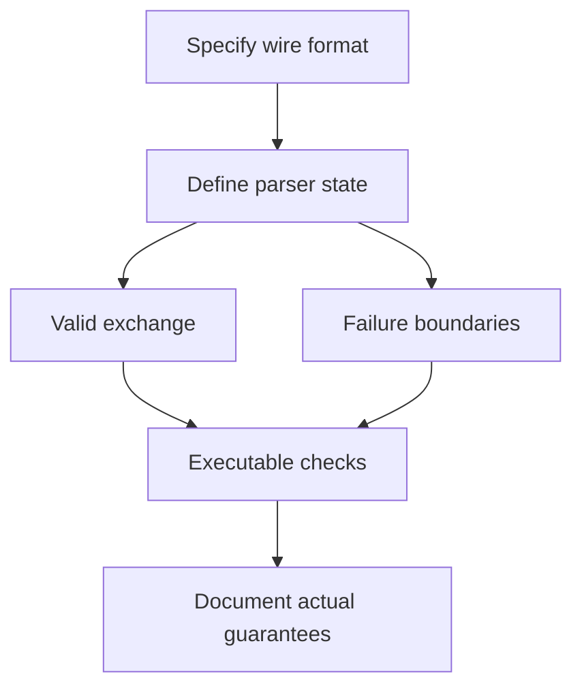

# Chapter 11 — Seven practical projects

🔴 · [Course home](../README.md) · [Setup](../START_HERE.md)

## 🎯 Learning Objectives

Integrate framing, ownership, concurrency and failure policies into seven complete laboratory projects; test protocol boundaries and document limitations.

## 🤔 Why Do We Need This?

A collection of socket calls becomes an application only when you specify what the bytes mean, who can send next and how completion/failure is recognized.

## Further reading and labs

- [Tcp Echo](tcp-echo/README.md)
- [Tcp Chat](tcp-chat/README.md)
- [Udp Chat](udp-chat/README.md)
- [Multi Client Chat](multi-client-chat/README.md)
- [File Transfer](file-transfer/README.md)
- [Simple Http Server](simple-http-server/README.md)
- [Concurrent Network Server](concurrent-network-server/README.md)

## 🧠 Concept

The projects deliberately progress from byte echo to application protocols. Echo verifies a transport path; TCP chat adds concurrent terminal/network input; UDP chat exposes datagram semantics; multi-client chat adds line parsing and bounded per-peer queues; file transfer adds binary framing and acknowledgement; HTTP introduces textual request parsing; the concurrent server project compares service models.

Each project guide contains a problem statement, requirements, architecture, workflow, implementation links, build/run commands, tests and extensions. Several projects deliberately reuse proven chapter implementations rather than copying them into a second source file that can drift. Local Makefiles compile the canonical sources and place binaries in the root build directory.

A project is complete for its stated teaching scope, not for every production concern. The HTTP server intentionally supports fixed routes and closes each connection. File transfer does not send filenames over the wire. Chat has no identity authentication. State and test these limits before proposing additional features.

The most useful extension is often a failure scenario: split a header across writes, drop a client midway through a body, keep a receiver slow, or send an oversized record. A project that works only when one friendly client sends one short string has not exercised its protocol.

## 🏗️ Architecture



## 🔄 How It Works

Write the wire format; identify state and descriptor ownership; compile the implementation; run two or more endpoints; verify normal traffic; exercise truncation/limits/disconnects; document observations.

## 🔧 Important Functions

All preceding socket APIs; project parsers add `read`, `write`, `fread`, `fwrite`, `fsync`, `snprintf` and explicit buffer length accounting.

See the [API reference](../docs/socket-api.md) for signatures, parameters, returns,
examples and common mistakes. Shared helpers are explained in
[common/README.md](../common/README.md).

## 💻 Minimal Example

Read the complete, compilable [source](simple-http-server/server.c). This is an opening excerpt
for orientation; compile the complete file using the command below:

```c
/* Step: This is a deliberately small HTTP subset: GET and HEAD, two fixed routes, close after response. */
static int response(int fd, int status, const char *reason, const char *body, int head) {
    char headers[512]; size_t length = strlen(body);
    int n = snprintf(headers, sizeof headers,
        "HTTP/1.1 %d %s\r\nContent-Type: text/plain; charset=utf-8\r\n"
        "Content-Length: %zu\r\nConnection: close\r\nX-Content-Type-Options: nosniff\r\n%s\r\n",
        status, reason, length, status == 405 ? "Allow: GET, HEAD\r\n" : "");
    if (n < 0 || (size_t)n >= sizeof headers) { errno = EOVERFLOW; return -1; }
    if (send_all(fd, headers, (size_t)n) < 0) return -1;
    return head ? 0 : send_all(fd, body, length);
}
static int serve(int fd) {
    char request[8193]; size_t used = 0;
    /* Step: TCP can split headers anywhere. Accumulate until CRLF CRLF, with an 8 KiB limit. */
```

## 🔍 Line-by-Line Explanation

Follow the [numbered source and walkthrough](../docs/walkthroughs/http_server.md) alongside the program.
Each source block explains its purpose, underlying OS behavior, failure path and
an extension. Important socket operations also have individual entries in the
[API reference](../docs/socket-api.md). Trace variable lengths as carefully as
function names.

## ▶️ Compilation

From the repository root:

```bash
make -j2
```

The [build/run catalogue](../docs/program-catalogue.md) gives a direct `cc` command
for every executable. You can use `make -j2` once to build all examples.

## ▶️ Execution

Run the marked terminal commands in separate terminals where applicable.

```bash
# Terminal A
./build/http_server 8080
# Terminal B (optional curl package)
curl -i http://127.0.0.1:8080/
curl -I http://127.0.0.1:8080/health
# Automated project checks
make test
```

## 📤 Expected Output

```text
GET / returns 200 and the text Socket Programming Lab.
HEAD /health returns headers with Content-Length: 3 and no body.
```

Values in angle brackets describe variable output; they are not recorded results.

## 🧪 Experiment

Send a GET request in several TCP writes. Compare the parsed response with a one-write request. Then try an unknown route and an unsupported method.

## 🛠️ Modify the Code

Add a /time route that constructs a bounded response body and computes Content-Length from the actual body bytes. Decide whether responses should use wall-clock UTC or another explicit representation.

## 🐛 Common Errors

Using a filename received from the network as an unchecked local path; acknowledging a file before finishing its write; claiming a teaching HTTP subset supports all HTTP/1.1 features.

## 💡 Debugging Tips

Separate protocol errors from I/O errors in logs. For every response, verify the actual body length against the advertised framing length.

## 🎯 Practice Problems

- 🟢 **Beginner:** Choose the right base project for a binary sensor-log upload.
- 🟡 **Intermediate:** Why does the HTTP project map only fixed routes?
- 🔴 **Advanced:** A file exists but the sender did not receive OK. Is it safe to retry blindly?

Attempt these before opening [worked solutions](solutions.md).

## 📝 Exam Questions

**Question:** What makes a protocol implementation testable?

**Worked answer:** A precise wire format, bounded inputs, explicit state transitions and expected results for valid, truncated, oversized and out-of-order application operations.

## 🎤 Viva Questions

**Question:** Where are the seven project guides?

**Worked answer:** The seven subfolders linked below, each with its own README and a Makefile using canonical C sources.

## 💼 Interview Questions

**Question:** Why should application acknowledgements describe a specific event?

**Worked answer:** “Success” is ambiguous. State whether it means bytes accepted, parsed, written, flushed or committed; clients need that meaning for retries.

## 🚀 Mini Project

Complete all seven projects and maintain one lab notebook entry for a normal exchange and one failure boundary in each.

Record your prediction, commands, output and explanation using the
[lab notebook](../docs/lab-notebook.md). The [solutions](solutions.md) include an
acceptance checklist for this extension.

## ✅ Chapter Summary

Projects combine transport mechanics with explicit application meaning. State what success guarantees and test the boundaries.

## ➡️ Next Chapter

Continue to [Chapter 12 — Exam preparation and worked answers](../12-exam-preparation/README.md).
