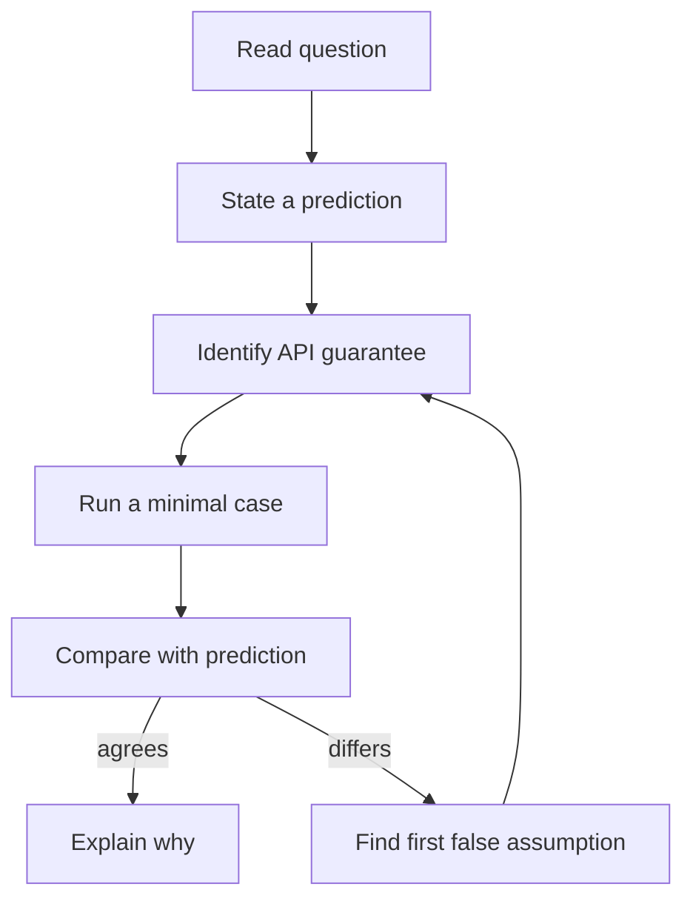

# Chapter 12 — Exam preparation and worked answers

🟡 · [Course home](../README.md) · [Setup](../START_HERE.md)

## 🎯 Learning Objectives

Reason through short answers, long answers, MCQs, viva, output prediction, debugging and programming questions; explain why incorrect alternatives fail.

## 🤔 Why Do We Need This?

Exams often turn on a distinction such as EOF versus EAGAIN or a listener versus an accepted descriptor. Reasoning from the actual program is more reliable than memorizing a slogan.

## Further reading and labs

- [Short and long questions](important-questions.md)
- [MCQs](mcqs.md)
- [Viva](viva-questions.md)
- [Output, debugging and programming](practice-problems.md)
- [Mock exam](mock-exam.md)

## 🧠 Concept

Use the question banks in three passes. First solve without the answer key. Second justify your answer with a socket state, API return value or wire-format invariant. Third reproduce one relevant behavior with a runnable program.

For output predictions, separate deterministic content from nondeterministic values. A descriptor number, thread execution order, packet grouping or measured timing is not fixed merely because one run printed it that way. A byte-order roundtrip or a mutex-protected final count has a stronger guarantee.

For debugging questions, locate the first invalid assumption. Examples include treating recv bytes as a NUL-terminated string, converting -1 to size_t, writing past a buffer using an unvalidated frame length, or calling a blocking helper from an event loop.

A good long answer links architecture to consequences. Do not just name fork/thread/epoll: explain descriptor ownership, memory sharing, overload policy, cleanup and the workload assumptions behind a proposed comparison.

## 🏗️ Architecture



## 🔄 How It Works

Predict before running; state the relevant invariant; select/derive an answer; compare with the worked explanation; run a counterexample to a wrong choice; record the corrected rule.

## 🔧 Important Functions

Review return-value conventions in the [API reference](../docs/socket-api.md), particularly recv, accept, select, poll and pthread functions.

See the [API reference](../docs/socket-api.md) for signatures, parameters, returns,
examples and common mistakes. Shared helpers are explained in
[common/README.md](../common/README.md).

## 💻 Minimal Example

Read the complete, compilable [source](../00-prerequisites/byte-order.c). This is an opening excerpt
for orientation; compile the complete file using the command below:

```c
/* Step: Copy the representation to bytes without violating alignment or aliasing. */
int main(void) {
    uint16_t host = 9000;
    uint16_t network = htons(host);
    unsigned char bytes[sizeof network];
    memcpy(bytes, &network, sizeof bytes);
    printf("port=%u wire=%02x %02x roundtrip=%u\n",
           (unsigned)host, (unsigned)bytes[0], (unsigned)bytes[1],
           (unsigned)ntohs(network));
    return 0;
}
```

## 🔍 Line-by-Line Explanation

Follow the [numbered source and walkthrough](../docs/walkthroughs/byte_order.md) alongside the program.
Each source block explains its purpose, underlying OS behavior, failure path and
an extension. Important socket operations also have individual entries in the
[API reference](../docs/socket-api.md). Trace variable lengths as carefully as
function names.

## ▶️ Compilation

From the repository root:

```bash
make -j2
```

The [build/run catalogue](../docs/program-catalogue.md) gives a direct `cc` command
for every executable. You can use `make -j2` once to build all examples.

## ▶️ Execution

Run the marked terminal commands in separate terminals where applicable.

```bash
./build/byte_order
./build/counter
python3 tests/test_course.py CourseTests.test_06_fragmented_coalesced_and_empty_frames
```

## 📤 Expected Output

```text
wire=23 28 appears in the byte-order output; counter reports 400000; the framing test passes.
```

Values in angle brackets describe variable output; they are not recorded results.

## 🧪 Experiment

Predict each output before running. Then explain why exact file descriptor numbers or recv chunk sizes are intentionally absent from the answer key.

## 🛠️ Modify the Code

Write one new debugging question from your own failed experiment. Include the wrong code, a minimal input, the root cause and a corrected bounded implementation approach.

## 🐛 Common Errors

Claiming a universal fixed recv chunk size; calling epoll “always O(1)” without identifying the operation and workload; treating observed thread ordering as guaranteed.

## 💡 Debugging Tips

Trace ownership and return values on paper. Use the smallest existing lab to falsify an incorrect answer.

## 🎯 Practice Problems

- 🟢 **Beginner:** Explain all three outcomes of a positive-length TCP recv.
- 🟡 **Intermediate:** Predict the wire bytes for port 443 and a 5-byte frame body length.
- 🔴 **Advanced:** Design an exam experiment that proves TCP does not retain message boundaries without relying on one particular packet segmentation.

Attempt these before opening [worked solutions](solutions.md).

## 📝 Exam Questions

**Question:** How should a long-answer concurrency comparison be structured?

**Worked answer:** State the workload, describe ownership and scheduling for each model, identify resource limits, explain failure/cleanup and propose a controlled measurement instead of inventing throughput.

## 🎤 Viva Questions

**Question:** Can a correct answer include “depends on the OS”?

**Worked answer:** Yes, if it identifies the specific OS-dependent behavior and the portable guarantee that remains.

## 💼 Interview Questions

**Question:** What evidence would convince you that a parser handles fragmentation?

**Worked answer:** Tests splitting headers and bodies at multiple offsets, coalescing frames, including empty records, and rejecting truncation/oversized lengths, plus inspection of persistent parser state.

## 🚀 Mini Project

Take the supplied mock exam, mark against the rubric and rerun the example associated with each missed concept.

Record your prediction, commands, output and explanation using the
[lab notebook](../docs/lab-notebook.md). The [solutions](solutions.md) include an
acceptance checklist for this extension.

## ✅ Chapter Summary

State guarantees precisely, distinguish observation from specification, and support an answer with an executable experiment.

## ➡️ Next Chapter

Continue to [Chapter 13 — Interview preparation and design reasoning](../13-interview-preparation/README.md).
