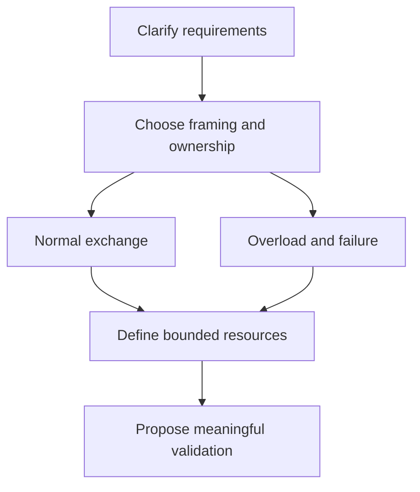

# Chapter 13 — Interview preparation and design reasoning

🔴 · [Course home](../README.md) · [Setup](../START_HERE.md)

## 🎯 Learning Objectives

Give concise technically correct socket answers; explain design trade-offs and failure modes; defend a bounded server architecture.

## 🤔 Why Do We Need This?

Interview questions often start with a single API and grow into a design problem. The interviewer needs to see how you reason from a socket operation to system behavior.

## Further reading and labs

- [Networking answers](networking-interview.md)
- [Socket answers](socket-interview.md)
- [Design exercises](design-exercises.md)

## 🧠 Concept

Use a three-part answer: define the concept, describe the mechanism and name a relevant limitation. For example, “accept returns a connected descriptor; the listening descriptor remains available; the new socket still needs a parser and an owner.” This is more useful than a list of function names.

When asked to design a service, clarify message sizes, concurrency, ordering, reliability and deadline requirements. Choose framing and a state machine before choosing an I/O API. Add bounded queues and admission policy before discussing an ambitious connection count.

Discuss epoll in terms of registered interest and ready-event delivery, not unsupported universal speed claims. A server dominated by CPU work can still require worker threads even when its socket layer uses an event loop. TLS also introduces additional read/write state and must come from a maintained library, not a home-built cryptographic scheme.

For failure reasoning, distinguish loss of a connection from knowledge about whether a request was processed. Retries can duplicate work after a response is lost. Application identifiers, idempotency and acknowledgements with precise meaning matter beyond transport reliability.

## 🏗️ Architecture



## 🔄 How It Works

Clarify requirements; define endpoint and wire format; choose ownership/concurrency; add deadlines/backpressure; reason through one normal and one failed exchange; describe meaningful validation.

## 🔧 Important Functions

Core socket APIs, half-close, nonblocking completion and readiness; consult the worked [socket questions](socket-interview.md) and [networking questions](networking-interview.md).

See the [API reference](../docs/socket-api.md) for signatures, parameters, returns,
examples and common mistakes. Shared helpers are explained in
[common/README.md](../common/README.md).

## 💻 Minimal Example

Read the complete, compilable [source](../08-io-multiplexing/epoll/server.c). This is an opening excerpt
for orientation; compile the complete file using the command below:

```c
/* Step: epoll stores interest in the kernel; this lesson uses level triggering. */
static uint32_t interests(struct connection *c) {
    return (wants_read(c) ? EPOLLIN : 0U) | (wants_write(c) ? EPOLLOUT : 0U);
}
static void remove_client(int queue, struct connection *c) {
    if (epoll_ctl(queue, EPOLL_CTL_DEL, c->fd, NULL) < 0) perror("epoll del");
    connection_close(c);
}
int main(int argc, char **argv) {
    if (argc != 2) { fprintf(stderr, "usage: %s PORT\n", argv[0]); return 1; }
    net_init(); int listener = net_listen("127.0.0.1", argv[1]);
    if (listener < 0) die("listen");
    if (nonblocking(listener) < 0) { close_fd(listener); die("nonblocking"); }
    int queue = epoll_create1(EPOLL_CLOEXEC);
```

## 🔍 Line-by-Line Explanation

Follow the [numbered source and walkthrough](../docs/walkthroughs/epoll_server.md) alongside the program.
Each source block explains its purpose, underlying OS behavior, failure path and
an extension. Important socket operations also have individual entries in the
[API reference](../docs/socket-api.md). Trace variable lengths as carefully as
function names.

## ▶️ Compilation

From the repository root:

```bash
make -j2
```

The [build/run catalogue](../docs/program-catalogue.md) gives a direct `cc` command
for every executable. You can use `make -j2` once to build all examples.

## ▶️ Execution

Run the marked terminal commands in separate terminals where applicable.

```bash
# Terminal A
./build/epoll_server 9000
# Terminal B
python3 11-real-world-projects/concurrent-network-server/load_test.py --port 9000 --clients 8
```

## 📤 Expected Output

```text
8 verified echo exchanges and a local timing observation; no universal performance claim.
```

Values in angle brackets describe variable output; they are not recorded results.

## 🧪 Experiment

Explain the server aloud while pointing to where it stores output, enables write readiness, detects EOF and removes a peer. Then ask what changes for an idle timeout.

## 🛠️ Modify the Code

Write a design note for a framed service with worker offload for CPU-heavy requests. Define who may access the socket and how completion returns to the event loop.

## 🐛 Common Errors

Jumping to an API before clarifying requirements; promising exactly-once application processing from TCP alone; claiming a successful send is a remote processing receipt.

## 💡 Debugging Tips

Use the [design exercises](design-exercises.md) to rehearse an overloaded/slow-client scenario, not just the successful path.

## 🎯 Practice Problems

- 🟢 **Beginner:** Answer “socket versus port” in two sentences.
- 🟡 **Intermediate:** Explain how a peer half-close affects a queued-response server.
- 🔴 **Advanced:** Propose a fair service design for many idle connections and occasional expensive requests.

Attempt these before opening [worked solutions](solutions.md).

## 📝 Exam Questions

**Question:** What separates reliability from exactly-once application behavior?

**Worked answer:** Transport reliability orders/retransmits bytes; it does not tell a retrying client whether an earlier request committed before disconnection. Exactly-once effects need application-level semantics and durable coordination.

## 🎤 Viva Questions

**Question:** What does recv returning zero mean after requesting zero bytes?

**Worked answer:** It does not prove peer shutdown. The usual TCP EOF interpretation assumes a positive requested length.

## 💼 Interview Questions

**Question:** How would you compare two server architectures fairly?

**Worked answer:** Keep protocol, payloads, client behavior and hardware controlled; report concurrency, throughput/latency distributions, CPU/memory, errors and repeatability. First establish correctness.

## 🚀 Mini Project

Present a five-minute design defense for the concurrent server project, including one overload scenario and one ambiguous retry scenario.

Record your prediction, commands, output and explanation using the
[lab notebook](../docs/lab-notebook.md). The [solutions](solutions.md) include an
acceptance checklist for this extension.

## ✅ Chapter Summary

Good answers connect API guarantees to application requirements, ownership, limits and evidence.

## ➡️ Next Chapter

Return to the [project guides](../11-real-world-projects/README.md) and implement one extension with your own tests.
