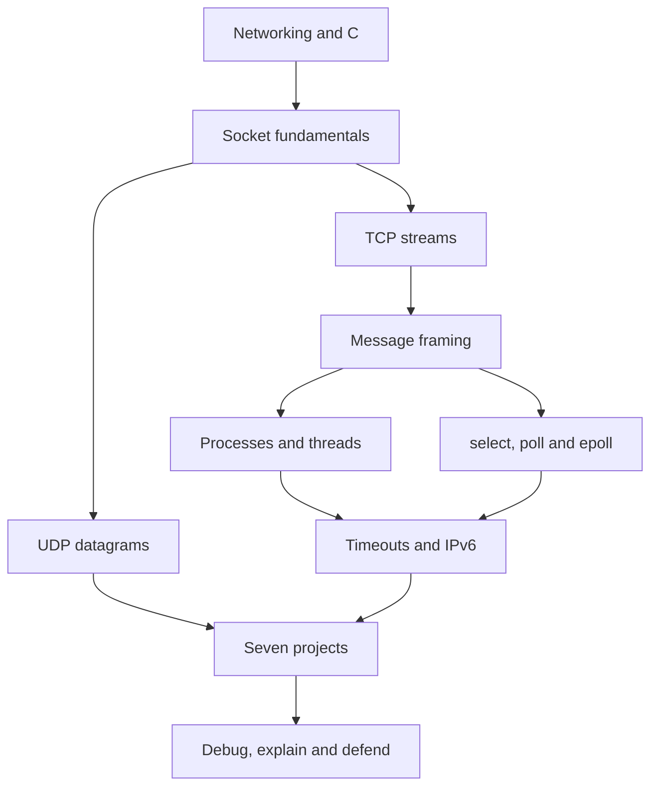

# 🚀 Socket Programming — Zero to Advanced

**Learn Computer Networking by Building Real Programs.**

A complete chapter-wise journey from networking fundamentals to advanced socket
programming and practical networking projects. C is the implementation language;
Linux/POSIX APIs are visible throughout. Python is used only for verification tools.


These are descriptive badges, not live build results or popularity statistics.

Prepared for **Shivam Singh · MathTech**. “I HAVE NO LIMITATION”

## Why this repository exists

A successful `send()` does not mean the other application consumed a message.
Two calls to `send()` do not create two records on a TCP connection. A listening
socket is not the socket used to speak to an accepted client. These distinctions
are easier to learn by running small programs and examining their behavior.

This course combines theory, annotated C, terminal laboratories, modification
exercises, solved questions and seven projects. Each lesson follows: concept →
reason → architecture → API → working code → explanation → experiment → debugging
→ practice → project.

## Who this is for

Students, C programmers entering networking, engineering learners, interview
candidates and instructors building a practical laboratory. Start with basic C
arrays, functions and pointers; Chapter 00 gives a readiness checklist.

## Table of contents

- [Start here: installation and first run](START_HERE.md)
- [Course roadmap and progress](#course-roadmap-and-progress)
- [Socket fundamentals](01-socket-fundamentals/README.md)
- [TCP server](02-tcp-server/README.md) and [TCP client](03-tcp-client/README.md)
- [Framed TCP conversations](04-tcp-client-server/README.md)
- [UDP programming](05-udp-programming/README.md)
- [Multiple clients](06-multiple-client-server/README.md)
- [Processes and threads](07-concurrent-programming/README.md)
- [I/O multiplexing](08-io-multiplexing/README.md)
- [Advanced sockets](09-advanced-sockets/README.md)
- [Projects](11-real-world-projects/README.md)
- [Debugging](10-network-debugging/README.md)
- [Exam preparation](12-exam-preparation/README.md)
- [Interview preparation](13-interview-preparation/README.md)
- [Socket API reference](docs/socket-api.md)
- [Build/run catalogue](docs/program-catalogue.md)
- [Source walkthroughs](docs/walkthroughs/README.md)
- [Verification report](VERIFICATION.md)
- [Contributing](CONTRIBUTING.md) · [License](LICENSE)

## Quick start

Use Ubuntu Linux or an Ubuntu terminal inside Windows WSL2. Run from the extracted
repository root; two terminal windows must be inside the same Linux environment.

```bash
sudo apt update
sudo apt install -y build-essential python3
make -j2
```

Terminal A starts a server and waits for one connection:

```bash
./build/tcp_server 9000
```

Terminal B connects, sends a message, half-closes its sending direction and reads
the complete echo:

```bash
./build/tcp_client 127.0.0.1 9000 "Hello, sockets!"
```

Expected client output: `Hello, sockets!`. This first server exits after one
client; later servers keep accepting. Full beginner setup is in
[START_HERE.md](START_HERE.md), including extraction paths, WSL installation and
common first-run problems.

## Course roadmap and progress



| Chapter | Topic | Level | Complete |
|---|---|---|---|
| 00 | [Networking and C prerequisites](00-prerequisites/README.md) | 🟢 | ⬜ |
| 01 | [Socket fundamentals](01-socket-fundamentals/README.md) | 🟢 | ⬜ |
| 02 | [Your first TCP server](02-tcp-server/README.md) | 🟢 | ⬜ |
| 03 | [Your first TCP client](03-tcp-client/README.md) | 🟢 | ⬜ |
| 04 | [Framing and interactive TCP](04-tcp-client-server/README.md) | 🟢 | ⬜ |
| 05 | [UDP and broadcast](05-udp-programming/README.md) | 🟢 | ⬜ |
| 06 | [Serving multiple clients](06-multiple-client-server/README.md) | 🟡 | ⬜ |
| 07 | [Processes, threads and synchronization](07-concurrent-programming/README.md) | 🟡 | ⬜ |
| 08 | [select, poll and epoll](08-io-multiplexing/README.md) | 🔴 | ⬜ |
| 09 | [Nonblocking I/O, timeouts and IPv6](09-advanced-sockets/README.md) | 🔴 | ⬜ |
| 10 | [Network debugging laboratory](10-network-debugging/README.md) | 🟡 | ⬜ |
| 11 | [Seven practical projects](11-real-world-projects/README.md) | 🔴 | ⬜ |
| 12 | [Exam preparation and worked answers](12-exam-preparation/README.md) | 🟡 | ⬜ |
| 13 | [Interview preparation and design reasoning](13-interview-preparation/README.md) | 🔴 | ⬜ |

Editable learner checklist:

- [ ] Explain networking basics, addresses and ports.
- [ ] Create and close a socket without leaking it.
- [ ] Run the TCP server and client.
- [ ] Prove that a TCP stream needs application framing.
- [ ] Send and receive UDP datagrams.
- [ ] Compare iterative, forked and threaded servers.
- [ ] Protect shared state correctly.
- [ ] Explain select, poll and epoll readiness.
- [ ] Handle deadlines, errors and IPv6.
- [ ] Debug using operating-system evidence.
- [ ] Complete all seven projects.
- [ ] Solve the exam and interview questions without opening the answers.

## What you get

| Resource | Contents |
|---|---|
| 14 chapter folders | Objectives, concepts, architecture, commands, exercises and answers |
| 31 C programs | Standalone beginners' examples and progressively shared POSIX helpers |
| Seven projects | Echo, TCP chat, UDP chat, group chat, file transfer, HTTP, concurrent server |
| API reference | Purpose, signatures, parameters, returns, usage and mistakes |
| Source walkthroughs | Numbered source and explanations tied to the real implementation |
| Verification | Strict-warning build, loopback integration tests, relative-link checks |
| Exam/interview bank | MCQs, viva, output prediction, debugging and design questions |

## Project map

| Project | Main idea | Run guide |
|---|---|---|
| 1. TCP echo | Stream I/O and EOF | [Guide](11-real-world-projects/tcp-echo/README.md) |
| 2. TCP chat | Full-duplex terminal I/O | [Guide](11-real-world-projects/tcp-chat/README.md) |
| 3. UDP chat | Independent datagrams | [Guide](11-real-world-projects/udp-chat/README.md) |
| 4. Multi-client chat | Parsing and per-peer queues | [Guide](11-real-world-projects/multi-client-chat/README.md) |
| 5. File transfer | Binary framing and acknowledgement | [Guide](11-real-world-projects/file-transfer/README.md) |
| 6. Simple HTTP server | Request parsing and responses | [Guide](11-real-world-projects/simple-http-server/README.md) |
| 7. Concurrent server | Compare process, thread and readiness models | [Guide](11-real-world-projects/concurrent-network-server/README.md) |

## Build and check

```bash
make list
make test
make check-docs
make sanitize
```

`make sanitize` rebuilds with UndefinedBehaviorSanitizer and runs the integration
suite. Rebuild normally afterward with `make clean` and `make`. No third-party C
libraries or Python packages are required. Optional packet tools are listed in
the debugging chapter. CI configuration is supplied; it has not been run on your
future GitHub repository.

## Scope and implementation limits

The course targets **Linux**, including Linux in WSL2. `epoll` is Linux-specific;
native Windows Winsock and macOS builds are not implemented. Servers bind
loopback by default. The examples are learning implementations: no TLS,
authentication, persistent chat history or production deployment tooling.

Read the [protocol and limits guide](docs/protocols-and-limits.md) before extending
an example. Important limits are explicit: 1 MiB framed echo messages, 32 chat
peers, 512-byte chat lines and a 64 MiB received file cap. Bounded queues and
operation timeouts teach resource management; production admission control and
end-to-end request deadlines require further design.

## Study method

Keep a notebook with four columns: prediction, command, observation and
explanation. A passing program is only the beginning. Explain who owns every
file descriptor, where bytes are buffered, how a message boundary is recognized,
and which event releases a blocked operation. Use the
[lab notebook template](docs/lab-notebook.md) for each experiment.

## 🚀 Start Learning

1. Start with [00-prerequisites](00-prerequisites/README.md).
2. Continue chapter by chapter.
3. Run every example.
4. Modify the programs.
5. Solve the exercises and compare the solutions.
6. Build the seven projects.
7. Complete the interview questions.

Don't just read the code. Run it. Break it. Debug it. Understand it. Build
something with it.

⭐ If this repository helps you learn socket programming, consider giving it a
star and sharing it with other students.
